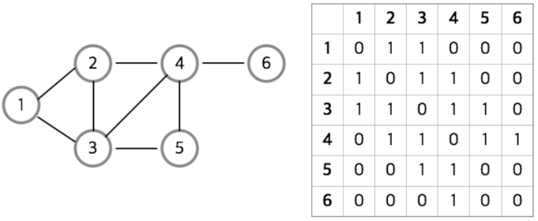

# 그래프(Graph)
* 요소들이 서로 복잡하게 연결되어 있는 관계를 표현하는 자료구조
* 정점(vertex), 간선(edge)의 집합


* G = (V, E)

### 용어
|용어|뜻|
|---|---|
|정점(Vertex or Node)|데이터를 저장하는 위치|
|간선(Edge)|정점(노드)를 연결하는 선. =링크(Link)=브랜치(branch)|
|인접 정점(adjacent vertex)|간선에 의해 직접 연결된 정점|
|단순 경로(simple path)|경로 중에서 반복되는 정점이 없는 경우를 의미한다. 한붓 그리기와 같이 같은 간선을 지나가지 않는 경로|
|차수(degree)|무방향 그래프에서 하나의 정점에 인접한 정점의 수|
|진출 차수(in-degree)|방향 그래프에서 외부로 향하는 간선의 수|
|진입 자수(out-degree)|방향 그래프에서 외부에서 들어오는 간선의 수|
|경로 길이(path length)|경로를 구성하는데 사용된 간선의 수|
|사이클(cycle)|단순 경로의 시작 정점과 종료 정점이 동일한 경우|

### 그래프 종류
1. 무방향 그래프(Undirected Graph)
* 두 정점을 연결하는 간선에 방향이 없는 그래프
* 정점 Vi와 Vj를 연결하는 간선 : (Vi, Vj)
* (Vi, Vj)와 (Vj, Vi)는 같은 간선


* 그래프 G1
* V(G1)={A,B,C,D}
* E(G1)={(A,B), (A,D), (B,C), (B,D), (C,D)}

---

2. 방향 그래프(Directed Graph)
* 간선에 방향이 있는 그래프
* 정점 Vi와 Vj를 연결하는 간선 : <Vi, Vj>
  * Vi : 꼬리(tail)
  * Vj : 머리(head)
* <Vi, Vj>와 <Vj, Vi>는 서로 다른 간선


* 그래프 G2
* V(G1)={A,B,C,D}
* E(G1)={<A,B>, <A,D>, <B,C>, <B,D>, <C,D>}

---

3. 완전 그래프(Complete Graph)
* 한 정점에서 다른 모든 정점과 연결되어 최대 간선 수를 갖는 그래프
* 정점이 n개인 완전 그래프의 최대 간선 수
  * 무방향 그래프 : n(n-1)/2
  * 방향 그래프 : n(n-1)


---

4. 부분 그래프(Subgraph)
* 기존의 그래프에서 일부 정점이나 간선을 제외하여 만든 그래프


---

5. 가중 그래프(Weight Graph)
* 정점을 연결하는 간선에 가중치(weight)를 할당한 그래프


---

6. 유향 비순환 그래프(DAG, Directed Acyclic Graph)
* 방향 그래프에서 사이클이 없는 그래프


---

7. 연결 그래프(Connected Graph)
* 떨어져 있는 정점이 없는 그래프


---

8. 비연결(단절) 그래프(Disconnected Graph)
* 연결되지 않은 정점이 있는 그래프


# 그래프 구현
1. 인접 행렬(Adjacency Matrix)

* 2차원 배열로 그래프를 구현하는 방식
* 그래프에 간선이 많이 존재하는 밀집 그래프(Dense Graph)에서 사용
* 간선이 존재 : 1, 없는 칸 : 0
* 만약 가중치 존재한다면 해당 가중치 값
* 무방향 그래프는 대칭 행렬(Symmetric Matrix)
* 장점
  * 간단하게 구현
  * 두 정점을 연결하는 간선의 존재 여부 (M[i][j])를 O(1) 안에 알 수 있다.
  * 정점의 차수 는 O(N) 안에 알 수 있다. : 인접 배열의 i번 째 행 또는 열을 모두 더한다.
* 단점
  * N^N 크기의 2차원 배열을 사용하기 때문에 메모리가 필요 이상으로 많이 사용
  * 예) 정점이 10000개인데 간선이 5개만 존재
  * 어떤 노드에 인접한 노드들을 찾기 위해서는 모든 노드를 전부 순회해야 한다.
  * 그래프에 존재하는 모든 간선의 수는 O(N^2) 안에 알 수 있다. : 인접 행렬 전체를 조사한다.

---

2. 인접 리스트(Adjacency List)

* 정점에 연결되어 있는 정점들만 리스트로 나타내는 그래프 표현 방식
* 그래프 내에 적은 숫자의 간선만을 가지는 희소 그래프(Sparse Graph)에서 사용
* 모든 정점(혹은 노드)을 인접 리스트에 저장
* 무방향 그래프에서 간선은 두 번 저장
```
1: 2, 3
2: 1, 3, 4
3: 1, 2, 4, 5
4: 2, 3, 5, 6
5: 3, 4
6: 4
```
* 장점
  * 필요한 만큼의 메모리만 사용하기 때문에 메모리 낭비가 없다.
  * 어떤 노드에 인접한 노드들 쉽게 찾을 수 있다.
  * 그래프에 존재하는 모든 간선의 수는 O(N+E) 안에 알 수 있다.
* 단점
  * 간선의 존재 여부와 정점의 차수 : 정점 i의 리스트에 있는 노드의 수 즉, 정점 차수만큼의 시간이 필요하다.
  * 예) 모든 노드가 10000개 인데 1번 노드에 9999개의 간선이 존재하는 경우 9999번째 인접 정점을 확인하는데는 9999번의 탐색이 필요)

# 그래프 탐색
1. BFS(너비 우선 탐색, Breath-Frist Search)
* 루트 노드(혹은 다른 임의의 노드)에서 시작해서 인접한 노드를 먼저 탐색하는 방법
* 두 노드 사이의 최단 경로 혹은 임의의 경로를 찾고 싶을 때 이 방법을 선택한다.

3. DFS(깊이 우선 탐색, Depth-First Search)
* 루트 노드(혹은 다른 임의의 노드)에서 시작해서 다음 분기(branch)로 넘어가기 전에 해당 분기를 완벽하게 탐색하는 방법
* 모든 노드를 방문 하고자 하는 경우에 이 방법을 선택한다.
* 깊이 우선 탐색이 너비 우선 탐색보다 좀 더 간단하다.
