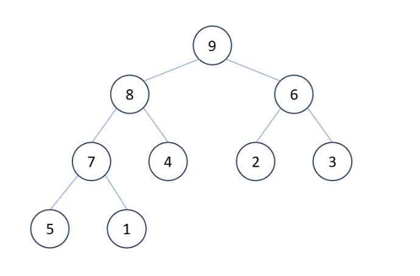
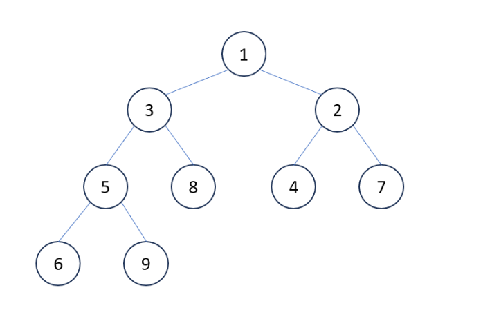
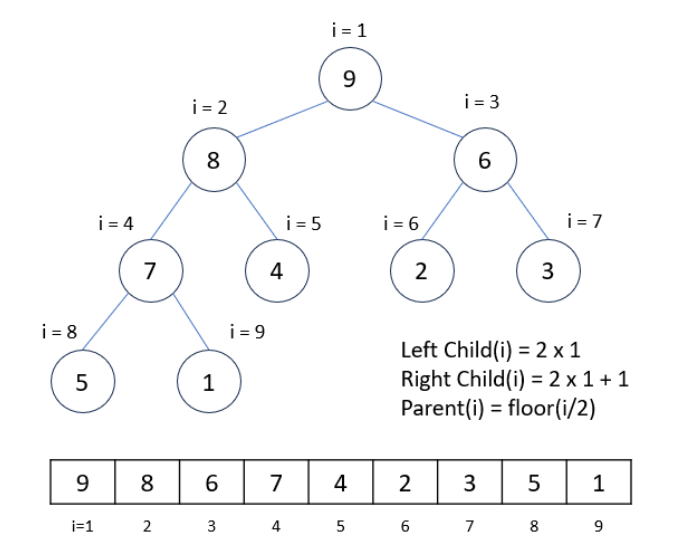
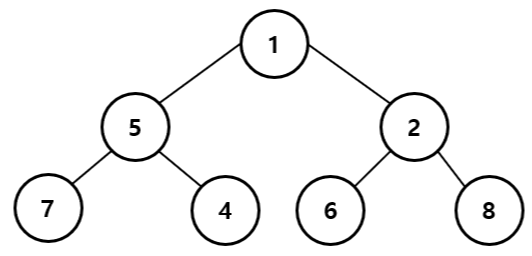
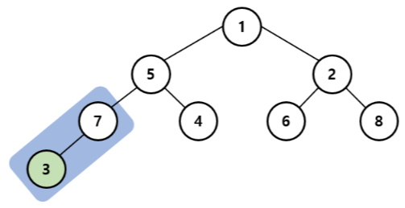
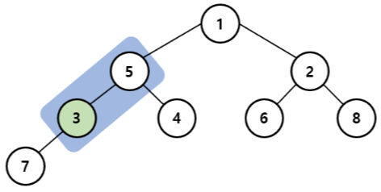
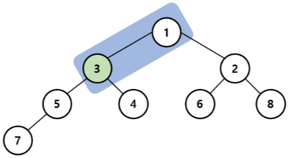
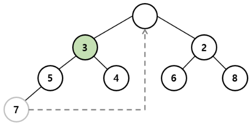
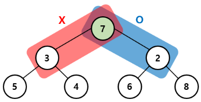
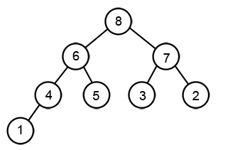

# 완전 이진 트리(Complete Binary Tree)
* 부모 노드 밑에 자식 노드가 최대 2개
* 마지막 레벨을 제외한 모든 레벨에 노드가 완전치 채워진 트리 구조

# 우선순위 큐(Priority Queue)
* 큐(Queue) : 먼저 들어오는 데이터가 먼저 나가는 **FIFO(First In First Out)**
* 우선순위 큐(Priority Queue) : 우선순위가 높은 데이터가 먼저 나가는 자료구조

# Heap(힙)
* 최대값과 최소값을 빠르게 찾기 위해 고안된 **완전 이진 트리(Complete Binary Tree)**
* **우선순위 큐(Priority Queue)** 를 위하여 만들어진 자료구조
* 부모 노드와 자식 노드 간에 특정한 조건을 만족하는 자료구조(반정렬 상태)
* 이진 탐색 트리(BST)와 달리 중복된 값이 허용

### 노드(Node)
* **부모 노드(Parent Node)** : 특정 노드의 상위에 위치한 노드
* **자식 노드(Child Node)** : 특정 노드의 하위에 위치한 노드
* 루트 노드(Root Node) : 트리 구조에서 가장 상위에 위치한 노드
* 단말 노드(Leaf Node) : 가장 밑에 위치하면서 자식 노드가 없는 노드
* 레벨(Level) : 루트 노드부터 시작, 트리의 몇 번째 층에 있는지(루트 노드의 레벨 = 0)
* 높이(Height) : 리프 노드부터 시작(루트 노드의 높이 = 트리의 전체 높이)

### 힙의 종류
* **최대 힙(Max-Heap)** : 모든 부모 노드가 자식 노드보다 크거나 같은 값을 갖는 힙, 따라서 루트노드가 가장 큰 값
* key(부모노드) ≥ key(자식노드)


* **최소 힙(Min-Heap)** : 모든 부모 노드가 자식 노드보다 작거나 같은 값을 갖는 힙, 따라서 루트노드가 가장 작은 값
* key(부모노드) ≥ key(자식노드)



* 오름차순 구현을 위해서는 Min Heap을 사용하고, 내림차순 구현을 위해서는 Max Heap을 사용하는 것이 편하다.

### 힙 구현 방법
* 보통 **배열(Array)** 을 통해 구현
* 완전 이진 트리이므로 중간에 비어있는 요소가 없기 때문에 배열 사용
* 인덱스가 1부터 시작



* **왼쪽 자식 노드 index** : 2 * (부모 노드 index)
* **오른쪽 자식 노드 index** : 2 * (부모 노드 index) + 1
* **부모 노드 index** : (자식 노드 index) / 2
  * 예) 루트 노드(9)의 인덱스가 1일 때
  * 왼쪽 자식 노드(8)의 인덱스 : 2 * 1 = 2
  * 오른쪽 자식 노드(6)의 인덱스 : 2 * 1 + 1 = 3

### 힙 삽입
* 힙에 삽입을 하기 위해서는 힙 트리의 성질을 만족시키면서 새로운 요소를 추가

1. 우선 완전 이진 트리의 마지막 노드에 이어서 새로운 노드를 추가한다.
2. 추가된 새로운 노드를 부모의 노드와 비교하여 교환한다.
3. 정상적인 힙트리가 될 때 까지(더이상 부모 노드와 교환할 필요가 없을 때까지) 2번을 반복한다.

```
void push(int data) {
	heap[++heap_count] = data;

	int child = heap_count;
	int parent = child / 2;
	while (child > 1 && heap[parent] < heap[child]) {
		swap(&heap[parent], &heap[child]);
		child = parent;
		parent = child / 2;
	}
}
```

* 예) 최소 힙에서 새로 들어올 노드의 값 : 3


* 3과 부모노드 7과 비교 : 3이 더 작으므로 자리 변경


* 3과 부모노드 5과 비교 : 3이 더 작으므로 자리 변경


* 3과 부모노드 1과 비교 : 3이 더 크므로 멈추기



* 최악의 경우 새로 추가된 노드가 루트노트까지 비교하며 올라간다.
* 시간복잡도 : O(log n)

### 힙 삭제
* 힙 트리에서 루트노드가 가장 우선순위가 높으므로 루트 노드를 삭제
* 삭제가 이뤄진 후 힙 트리의 성질이 유지

1. 루트 노드를 삭제한다.
2. 루트 노드가 삭제된 빈자리에 완전 이진 트리의 마지막 노드를 가져온다.
3. 루트 자리에 위치한 새로운 노드를 자식 노드와 비교하여 교환한다.
4. 이때 최대 힙인 경우 자식노드 중 더 큰 값과 교환을 하며, 최소 힙인 경우 더 작은 값과 교환을 한다.
5. 정상적인 힙 트리가 될 때까지(더이상 자식노드와 교환할 필요가 없을 때까지) 3번을 반복한다.

```
int pop() {
        // returning the first element of a heap DS.
	int result = heap[1];

	swap(&heap[1], &heap[heap_count]);
	heap_count--;

	// Reconstructing tree structure after popping a root node.
	int parent = 1;
	int child = parent * 2;
	if (child + 1 <= heap_count) {
		child = (heap[child] > heap[child + 1]) ? child : child + 1;
	}

	while (child <= heap_count && heap[parent] < heap[child]) {
		swap(&heap[parent], &heap[child]);

		parent = child;
		child = child * 2;
		if (child + 1 <= heap_count) {
			child = (heap[child] > heap[child + 1]) ? child : child + 1;
		}
	}
	return result;
}
```

* 예) 최소힙
* 루트 노드를 반환(삭제)하고 마지막 노드를 루트 노드 자리로 변경


* 7의 왼쪽, 오른쪽 자식 노드 중 더 우선순위가 높은 2와 비교를 진행



* 최악의 경우 루트노트부터 가장 아래까지 내려간다.
* 시간복잡도 : O(log n)

### heap(완전 이진 트리)과 이진 탐색 트리 비교
* 공통점
  * 이진 트리
* 차이점
  
|heap(완전 이진 트리, 최대 힙)|이진 탐색 트리|
|:-----:|:-----:|
|부모 노드의 값 >= 자식 노드|왼쪽 자식 노드의 값 < 부모 노드 값 < 오른쪽 자식 노드의 값|
|중복 허용|중복 불가|
|최대/최소 값 검색을 위한 구조|탐색을 위한 구조|

# 힙 정렬(Heap Sort)
* 힙을 이용하여 배열을 정렬하는 알고리즘
1. n개의 노드에 대한 완전 이진 트리를 구성한다. 이때 루트 노드부터 부모노드, 왼쪽 자식노드, 오른쪽 자식노드 순으로 구성한다.
2. 최대 힙을 구성한다. 단말 노드를 자식노드로 가진 부모노드부터 구성하며 아래부터 루트까지 올라오며 순차적으로 만들어 갈 수 있다.
3. 가장 큰 수(루트에 위치)를 가장 작은 수와 교환한다.
4. 2와 3을 반복한다.

* 예) 가장 작은 것부터 가장 큰 것까지 정렬하고 싶은 리스트 { 6, 5, 3, 1, 8, 7, 2, 4 }
1. 힙 생성
  

  
|힙|추가 요소|교체 요소|
|---|---|---|
|null|6||
|6||5|
|6, 5|3||
|6, 5, 3|1||
|6, 5, 3, 1|8||
|6, **5**, 3, 1, **8**||5, 8|
|**6**, **8**, 3, 1, 5||6, 8|
|8, 6, 3, 1, 5|7||
|8, 6, **3**, 1, 5, **7**||3, 7|
|8, 6, 7, 1, 5, 3|2||
|8, 6, 7, 1, 5, 3, 2|4||
|8, 6, 7, **1**, 5, 3, 2, **4**||1, 4|
|8, 6, 7, 4, 5, 3, 2, 1|||

2. 힙 정렬

| 힙                     | 요소 교체          | 요소 삭제          | 요소 정렬          |
|------------------------|----------------------|----------------------|----------------------|
| 8, 6, 7, 4, 5, 3, 2, 1 | 8, 1                |                    |                    |
| 1, 6, 7, 4, 5, 3, 2, 8 |                    | 8                |                    |
| 1, 6, 7, 4, 5, 3, 2    | 1, 7                |                    | 8                |
| 7, 6, 1, 4, 5, 3, 2    | 1, 3                |                    | 8                |
| 7, 6, 3, 4, 5, 1, 2    | 7, 2                |                    | 8                |
| 2, 6, 3, 4, 5, 1, 7    |                    | 7                | 8                |
| 2, 6, 3, 4, 5, 1       | 2, 6                |                    | 7, 8              |
| 6, 2, 3, 4, 5, 1       | 2, 5                |                    | 7, 8              |
| 6, 5, 3, 4, 2, 1       | 6, 1                |                    | 7, 8              |
| 1, 5, 3, 4, 2, 6       |                    | 6                | 7, 8              |
| 1, 5, 3, 4, 2          | 1, 5                |                    | 6, 7, 8           |
| 5, 1, 3, 4, 2          | 1, 4                |                    | 6, 7, 8           |
| 5, 4, 3, 1, 2          | 5, 2                |                    | 6, 7, 8           |
| 2, 4, 3, 1, 5          |                    | 5                | 6, 7, 8           |
| 2, 4, 3, 1             | 2, 4                |                    | 5, 6, 7, 8        |
| 4, 2, 3, 1             | 4, 1                |                    | 5, 6, 7, 8        |
| 1, 2, 3, 4             |                    | 4                | 5, 6, 7, 8        |
| 1, 2, 3                | 1, 3                |                    | 4, 5, 6, 7, 8     |
| 3, 2, 1                | 3, 1                |                    | 4, 5, 6, 7, 8     |
| 1, 2, 3                |                    | 3                | 4, 5, 6, 7, 8     |
| 1, 2                   | 1, 2                |                    | 3, 4, 5, 6, 7, 8  |
| 2, 1                   | 2, 1                |                    | 3, 4, 5, 6, 7, 8  |
| 1, 2                   |                    | 2                | 3, 4, 5, 6, 7, 8  |
| 1                      |                    | 1                | 2, 3, 4, 5, 6, 7, 8 |
| 1, 2, 3, 4, 5, 6, 7, 8 |


### 힙 정렬 시간복잡도
* 힙 생성 : O(n)
* 힙 정렬에서는 힙에서 가장 큰(또는 가장 작은) 원소를 제거하고, 힙을 재정렬 하는 과정 n번 반복
* 제거 연산 : O(log n)을 n번 반복하므로 O(n log n)
* 따라서 힙 생성을 포함한 전체 시간 복잡도
* O(n) + O(n log n) = **O(n log n)**
