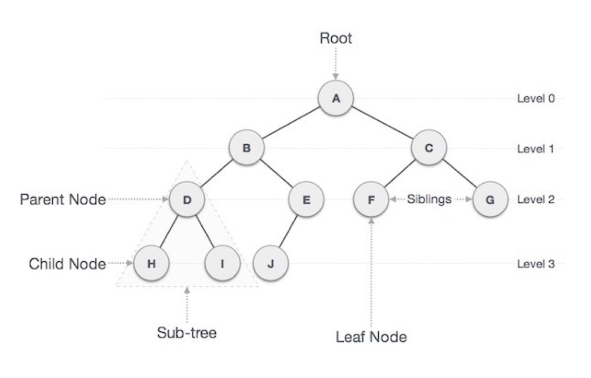

## 트리

* `트리`는 자식 노드와 부모 노드로 이루어진 계층적인 구조를 가지며, 무방향 그래프의 일종이자 사이클이 없는 자료 구조를 의미합니다.
* 힙(Heap)을 구현하는 방법 중 하나가 `트리`이다.

### Tree 용어

- **Root Node**: 트리구조에서 **가장 위에 있는 노드**. 즉 시작점이 되는 노드이다.
- **level**: 트리의 **특정 깊이**를 가지는 노드의 집합이다. 예를 들어 A의 레벨은 0, H, I, J의 레벨은 3이다.
- **차수(degree)**: **각 노드가 지닌 가지의 수**를 의미한다. 예를 들어 B의 차수는 2, E의 차수는 1이다.
- **Leaf Node(Terminal Node)**: 자식 노드가 없는 노드이다.
- **Internal Node** : 루트 노드와 리프 노드를 제외한 중간에 위치한 노드를 뜻한다.

### Tree 특징

* `트리 ` 자료구조는 일반적으로 **대상 정보의 각 항목들을 계층적으로 구조화할 때 사용하는 비선형 자료구조**입니다.
  * 비선형 자료구조란, 선형 자료구조와는 달리 하나의 자료 뒤에 여러개의 자료가 존재할 수 있는 형태를 말합니다.

* Tree 구조는 데이터의 '저장'의 의미 보다는 저장된 데이터를 **더 효과적으로 '탐색'** 하기 위해서 사용됩니다.

* 리스트와 다르게 데이터가 단순히 나열되는 구조가 아니라, **부모(parent)와 자식(child)의 계층적인 관계로 표현** 됩니다.

* 트리는 그래프(Graph)의 한 종류이며, **사이클이 없습니다.**

* 트리에서 Root Node를 제외한 모든 노드는 **단 하나의 부모노드를 가집니다.** 

## 이진 트리(Binary Tree)

트리 자료구조는 여러 유형이 있지만 가장 기본이 되는 트리는 **이진트리(Binary tree)구조** 입니다. 

- `이진트리`는 각각의 노드의 자식 노드의 개수가 2개 이하로 구성되어있는 트리를 의미합니다.
- 실전에서는 면접관이 **트리**라고 하면 보통 `이진 트리(binary tree)`라는 트리의 한 종류를 일컫는 경우가 많습니다.
- 두개의 자식노드 중에서 왼쪽에 있는 노드를 **`left node`** , 오른쪽에 있는 노드를 **`right node`** 라고 합니다.

### 이진 트리 종류

#### 편향 이진 트리 (Skewed Binary Tree)

* `편향 이진 트리`는 **하나의 차수로만 이루어져 있는 경우를 의미**합니다. 이러한 구조는 배열(리스트)와 같은 선형 구조이므로 **'Leaf Node'(가장 아래쪽에 위치한 노드) 탐색 시 모두 데이터를 전부 탐색해야 한다는 단점이 있어 효율적이지 못합니다.**

#### 포화 이진 트리 (Full Binary Tree)

* 포화 이진 트리는 **Leaf Node를 제외한 모든 노드의 차수가 두개로 이뤄진 경우**를 말합니다.
* 이 경우 해당 차수에 몇개의 노드가 존재하는지 바로 알수 있어서 **개수 파악이 용이**하다는 장점이 있습니다.

### **완전 이진 트리(Complete Binary Tree)**

* 포화 이진트리와 같은 개념으로 생성하지만 **모든 노드가 왼쪽부터 차근차근 생성**되는 이진 트리를 말합니다.

## 이진 탐색 트리 (Binary Search Tree)

* 이진탐색트리란 이진탐색(binary search)과 연결리스트(linked list)를 결합한 자료구조의 일종입니다. 
* 이진탐색의 효율적인 탐색 능력을 유지하면서도, 빈번한 자료 입력과 삭제를 가능하게끔 고안됐습니다. 예컨대 이진탐색의 경우 탐색에 소요되는 계산복잡성은 *𝑂*(log*𝑛*) 으로 빠르지만 자료 입력, 삭제가 불가능합니다. 연결리스트의 경우 자료 입력, 삭제에 필요한 계산복잡성은 *𝑂*(1)로 효율적이지만 탐색하는 데에는 *𝑂*(*𝑛*) 의 계산복잡성이 발생합니다. 두 마리 토끼를 잡아보자는 것이 이진탐색트리의 목적입니다.

#### 특징

- 각 노드의 왼쪽 서브트리에는 해당 노드의 값보다 작은 값을 지닌 노드들로 이루어져 있다.
- 각 노드의 오른쪽 서브트리에는 해당 노드의 값보다 큰 값을 지닌 노드들로 이루어져 있다. 
- 모든 노드는 중복된 값을 가지지 않는다.
- 왼쪽 서브트리, 오른쪽 서브트리 또한 이진탐색트리이다.

아래와 같이 데이터를 `이진 탐색 트리` 형태로 만들면 **데이터를 효율적으로 검색(탐색)할 수 있다.**
**원하는 값을 찾을 때까지 현재의 노드값보다 찾고자하는 값이 작으면 왼쪽으로 움직이고, 크면 오른쪽으로 움직인다.** 이렇게 원하는 값을 더 빠르게 찾을 수 있게 된다.

### Q. 이진탐색트리의 시간 복잡도는 얼마일까요?

* 위와 같이 트리가 균형잡히게 분포가 되었다면 탐색, 삽입, 삭제, 수정 모두 O(logN)이다.
* 하지만 이는 삽입 순서에 따라 달라진다. 예를 들어 아래와 같이 선형적인 형태의 트리의 경우, 시간 복잡도가 O(N)에 근접해질 수 있다. 
  * 따라서 **삽입 순서에 관계없이** 트리를 균형잡히게 만든 AVL트리, 레드블랙트리 등의 개념이 등장하였다.

### 이진 탐색(Binary Search)

* 이진 탐색이란 **데이터가 정렬돼 있는 배열**에서 특정한 값을 찾아내는 알고리즘이다. 배열의 중간에 있는 임의의 값을 선택하여 찾고자 하는 값 X와 비교한다. X가 중간 값보다 작으면 중간 값을 기준으로 좌측의 데이터들을 대상으로, X가 중간값보다 크면 배열의  우측을 대상으로 다시 탐색한다. 동일한 방법으로 다시 중간의 값을 임의로 선택하고 비교한다. 해당 값을 찾을 때까지 이 과정을  반복한다.

---

### 📢 같이 공부하면 좋을 면접 질문

* 트리란 무엇인가요?

* 비선형 자료구조란 무엇인가요?
* BST와 Binary Tree에 대해서 설명하세요. (N사 전화면접)

---

### 📌 참고 링크

* 책
* https://velog.io/@taeha7b/datastructure-tree

* https://velog.io/@kimdukbae/%EC%9E%90%EB%A3%8C%EA%B5%AC%EC%A1%B0-%ED%8A%B8%EB%A6%AC-Tree

* https://jiwondh.github.io/2017/10/15/tree/

* https://ratsgo.github.io/data%20structure&algorithm/2017/10/22/bst/

* https://velog.io/@humblechoi/자료구조-면접질문-모음
