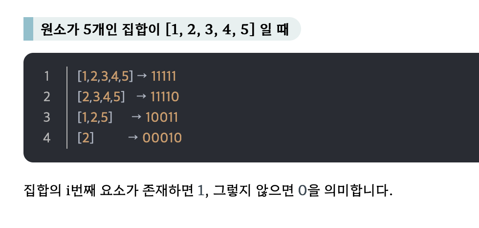

## 들어가기에 앞서..

* 이번 주제는 기술 면접 보다는, 코딩 테스트에 더 가까워 보이는 주제라고 생각합니다. 


# 완전 탐색

* **완전탐색**은 간단히 가능한 **모든 경우의 수를 다 체크해서 정답을 찾는 방법**입니다.즉, 무식하게 가능한 경우를 다 해보겠다는 방법을 의미합니다.

* 이 방법은 무식하게 한다는 의미로 **"Brute Force"**라고도 부르며, 직관적이어서 이해하기 쉽고 문제의 정확한 결과값을 얻어낼 수 있는 가장 확실하며 기초적인 방법입니다.

* 예를 들어, 4자리의 암호로 구성된 자물쇠를 풀려고 시도한다고 생각해보겠습니다. 이 자물쇠가 고장난 것이 아니라면, 반드시 해결할 수 있는 가장 확실한 방법은 0000 ~ 9999까지 모두 시도해보는 것입니다.(최대 10,000번의 시도로 해결 가능)


## 1. Brute Force

* 단순한 반복문(for)과 조건문(if)으로 모든 경우의 수를 만들어 답을 구하는 방법입니다.
* 시간복잡도를 많이 차지하기 때문에 기초적인 문제에서 주로 출제됩니다. (백준 기준 브론즈 ~ 실5 정도?)
* 아래 예시는 백준 2798 브론즈2 정답 코드 입니다. 

```python
n, m = map(int, input().split())
nums = list(map(int, input().split()))
list2 = []
for i in range( len(nums) - 2):
    for j in range(i + 1, len(nums) - 1):
        for k in range(j + 1, len(nums)):
            if nums[i] + nums[j] + nums[k] <= m:
                list2.append(m - (nums[i] + nums[j] + nums[k]))

print(m - min(list2))
```


## 2. 순열

* 순열은 서로 다른 N개를 일렬로 나열하는 경우의 수를 말합니다.
* 순열의 경우의 수는 **N!**으로 완전 탐색을 이용하기 위해서는 N이 한자리 수는 되어야 합니다.
* 예를 들어, N = 10인 경우에 약 360만 번의 연산을 수행하게 됩니다. 따라서 문제에서 주어진 N의 크기를 고려해야 합니다.
* 순열에 원소를 하나씩 채워가는 방식이며 재귀 함수를 이용할 수 있습니다.

* 파이썬과 C++의 경우 순열 라이브러리가 존재하기 때문에 이를 활용해서 문제를 해결하는 것이 좋습니다.


## 3. 비트마스크

* 2진수를 이용하는 컴퓨터의 연산을 이용하는 방식
* 나올 수 있는 모든 경우의 수가 "각각의 원소가 포함되거나, 포함되지 않는 두 가지 선택으로 구성되는 경우" 유용하게 사용가능합니다.
* 비트마스크의 예로, 원소가 n개인 집합의 모든 부분 집합을 구할 때 각 원소가 포함되는지 포함되지 않는지를 0, 1로 구분하여 체크하는 것이 있습니다.




## 4. 재귀

* 이 주제는 특히 1차 기술 면접에서, **손코딩 문제**에 종종 등장한다고 합니다.
* 예시를 들어서 설명하겠습니다.
  * 예를 들어, 총 4개의 숫자 중에 2개를 선택하는 경우를 모두 출력한다고 가정합니다. 
  * 1~4까지 숫자가 있고 2개를 중복 없이 선택하는 모든 경우의 수를 출력하고자 한다고 가정합니다.
  * 이를 반복문으로 표현한다면 다음과 같을 것입니다.

```python
# 수도 코드 형식으로 작성해 보았습니다.
for i in range(1, 5):
  choose i
  for j in range(i+1, 5):
    choose j
    print i, j
```


* 위의 경우 2중 for문을 통해 손쉽게 해결하였으나, 만약 **숫자 N개의 숫자 중 M개를 고르는 경우라고 할 때, N과 M이 매우 큰 숫자라면 어떻게 할까요?** 반복문을 수백, 수천 개를 작성하는 것은 불가능합니다.

* 따라서 이를 **재귀 함수를 활용**한다면 자기 자신을 호출함으로써 다음 숫자를 선택할 수 있도록 이동시켜 전체 코드를 간소화할 수 있습니다.
* 아래 예시는 50개의 숫자 중 4개를 선택하는 코드의 예시입니다.

```python
def combine(n, k, start, path, result):
    # 종료 조건: path의 길이가 k와 같을 때
    if len(path) == k:
        result.append(path.copy())
        return

    # 재귀 호출
    for i in range(start, n + 1):
        path.append(i)
        combine(n, k, i + 1, path, result)
        path.pop()

# 50개 중 4개를 선택하는 조합 생성
result = []
combine(50, 4, 1, [], result)

# 결과 출력 
print(result)
```


### 4-1. 백트래킹

* 재귀를 이용한 완전탐색 방식으로, 유망(promising)하지 않은 경로를 차단하고 **목표 지점에 도달할 수 있는 가능성이 있는 경로에 대해서만 탐색을 수행**하는 방법입니다.
* 흔히 완전탐색에서 시간복잡도를 줄이기 위해 문제에 **가지치기**를 사용한다고도 의미합니다. 
  * 가지치기란, 경로를 찾아가는 도중에 해가 되지 않을 것 같은 경로가 갔다면 더 가지 않고 되돌아오는 것을 의미합니다. 
  * 경우의 수를 줄이기 위해 사용합니다.
  * 시간이 오래 걸린다는 완전탐색의 단점을 보완하였습니다.


## 5. BFS / DFS

* 그래프 자료 구조에서 모든 정점을 탐색하기 위한 방법입니다.
* 이 부분은 다른 분이 준비를 해오시기 때문에, 여기서는 따로 언급하지 않겠습니다.


### 참고 링크

https://hongjw1938.tistory.com/78

https://hstory0208.tistory.com/entry/%EC%95%8C%EA%B3%A0%EB%A6%AC%EC%A6%98-%EC%99%84%EC%A0%84%ED%83%90%EC%83%89Exhaustive-search%EC%9D%B4%EB%9E%80

https://velog.io/@mincastle98/%EC%95%8C%EA%B3%A0%EB%A6%AC%EC%A6%98-%EC%99%84%EC%A0%84%ED%83%90%EC%83%89%EB%B0%B1%ED%8A%B8%EB%9E%98%ED%82%B9
