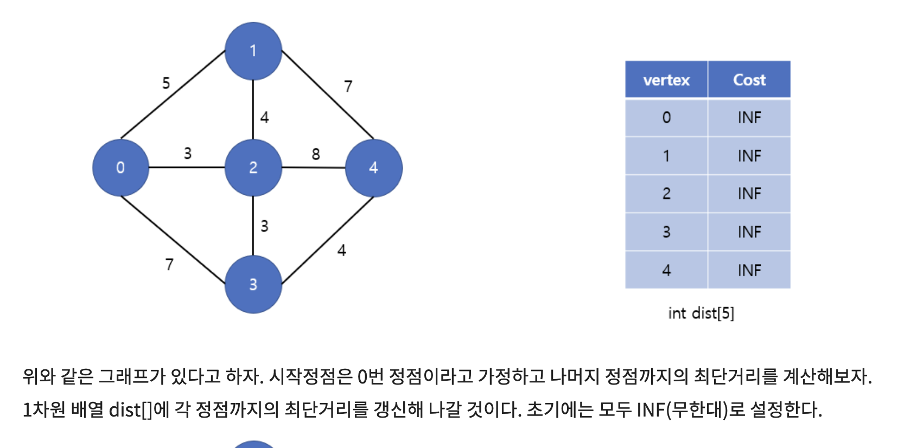
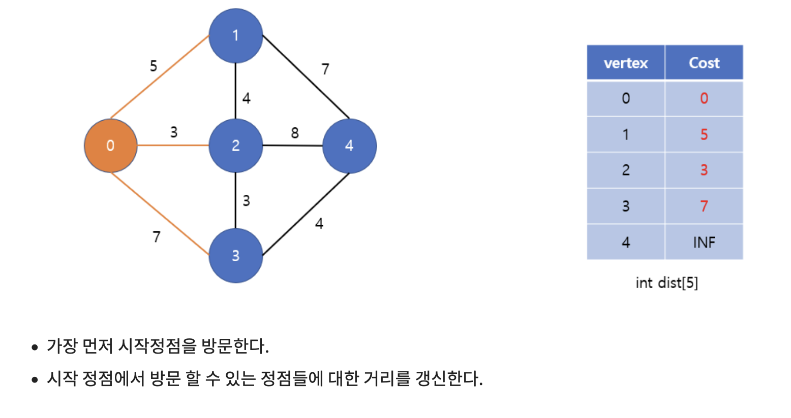
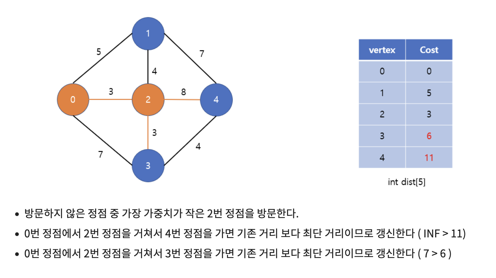
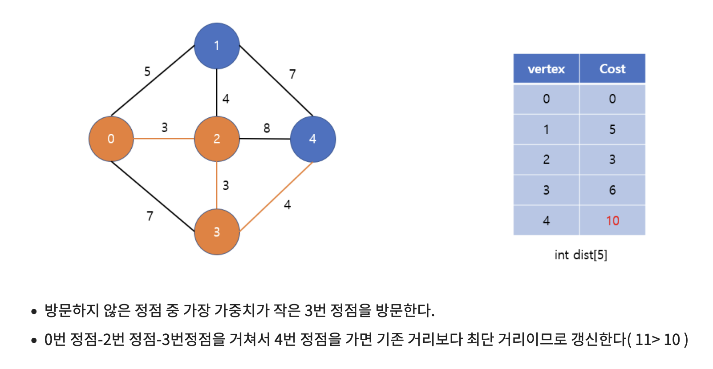
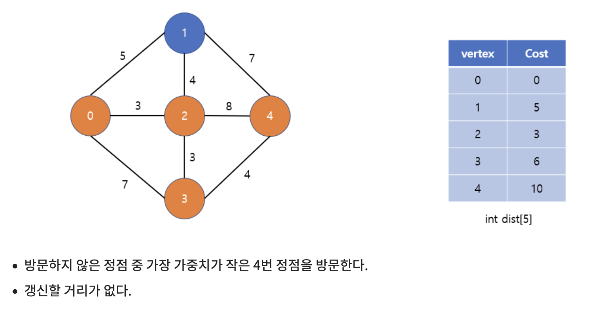
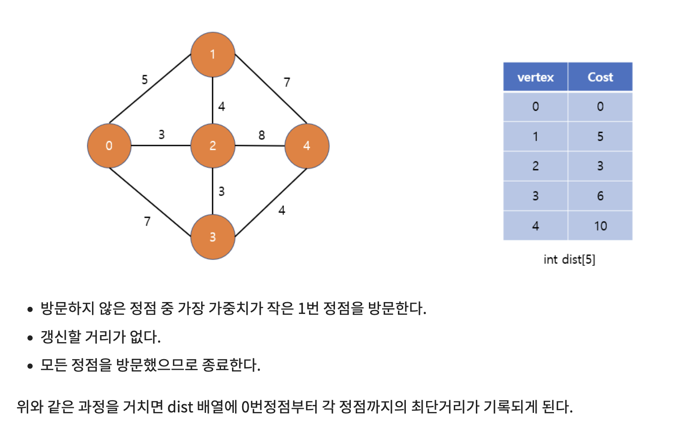
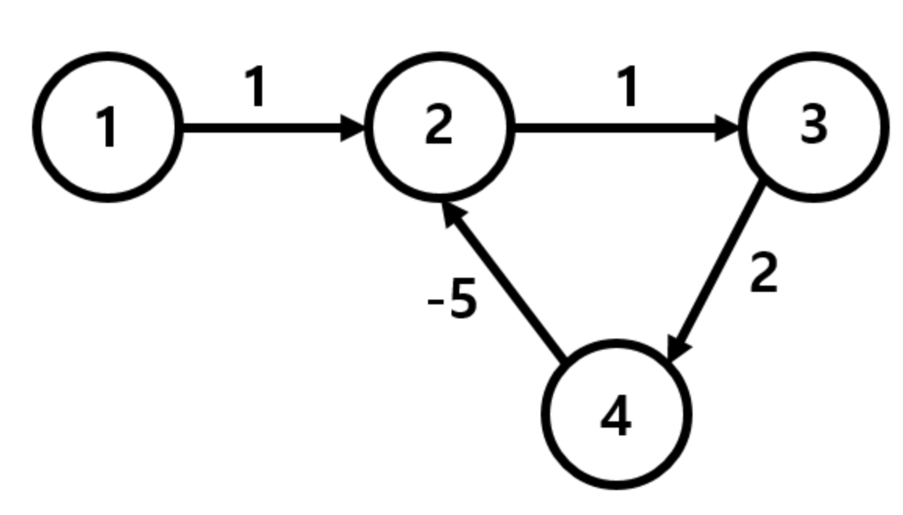

# 최단 거리 알고리즘

* 최단 거리 알고리즘이란 그래프 상에서 노드 간의 탐색 비용을 최소화하는 알고리즘입니다.
* 일반적으로 네비게이션과 같은 길찾기에 적용됩니다.

* 특정 정점에서 다른 정점들까지의 최단 거리를 구하는 알고리즘: 다익스트라 알고리즘, 벨만-포드 알고리즘
* 모든 정점 간 최단 거리를 구하는 알고리즘: 플로이드-워셜 알고리즘

## 1. 다익스트라 알고리즘

* 다이나믹 프로그래밍을 활용한 대표적인 최단 경로 알고리즘입니다.
  * **현재까지 알고 있던 최단 경로를 계속해서 갱신**하는 알고리즘입니다.

* 특정한 하나의 정점에서 다른 모든 정점으로 가는 최단 경로를 계산할 때 사용됩니다.
* **간선의 가중치가 음수가 아니어야 합니다**. (현실 세계에서는 음의 간선이 존재하지 않기 때문에, 다익스트라는 현실 세계에서 사용하기 좋은 알고리즘 중 하나입니다)

### 동작 방식

1. 출발 노드를 설정하고, 최단 거리 테이블을 초기화한다.
2. 방문하지 않은 노드 중 최단 거리가 가장 짧은 노드를 선택한다.
3. 해당 노드를 거쳐 다른 노드로 가는 비용을 계산하여 최단 거리 테이블을 갱신한다.    
   - 갱신 : 현재 테이블의 최단거리보다, 해당 노드를 거쳐가는 비용이 작으면 작은 경로로 교체
4. 3~4의 과정을 반복한다.

### 구현 방식 및 시간복잡도

* 다익스트라는 배열을 이용해 구현할 수도 있고, 우선순위 큐를 이용해 구현할 수도 있습니다.
* 정점의 개수를 V, 간선의 개수를 E라고 했을 때, 배열을 이용하는 경우 시간복잡도는 `O(V^2)` 이고 우선순위 큐를 이용하는 경우 `O((V+E)logV)` 입니다.

* 배열을 사용해서 다익스트라를 구현하면, 알고리즘 반복 단계에서 시작 노드와 가장 거리가 짧은 최단 노드를 찾아야 하는데, 이 때 **매번 선형탐색을 수행하므로** 시간복잡도가 증가한다는 단점이 존재합니다.
* 따라서, 우선순위 큐(최소 힙)를 사용해서 알고리즘을 구현하면 시간복잡도가 O((V+E)logV)으로 개선된 알고리즘을 사용할 수 있습니다. 

  * 힙에서 정점을 추출하는 데 O(logV) 시간이 소요되며, 이 작업은 모든 정점에 대해 한 번씩 수행됩니다. 따라서 총 O(VlogV) 시간이 필요합니다.
  * 각 간선은 한 번씩 검사되며, 힙에서 해당 정점의 위치를 조정하는 데 O*(log*V*) 시간이 소요됩니다. 따라서 총 O*(*E*log*V*) 시간이 필요합니다.

  따라서 전체 시간 복잡도는 O*((*V*+*E*)log*V*)가 됩니다.

## 2. 벨만-포드 알고리즘

* 다익스트라 알고리즘과 마찬가지로 한 노드에서 다른 노드까지의 최단 거리를 계산하는 알고리즘입니다. 
* 다익스트라 알고리즘과는 달리 **음수 간선이 포함되어 있을 때에도 사용이 가능합니다**.
  * 다만 음의 사이클이 있으면 최소 비용이 무한하게 줄어들어서 알고리즘을 적용할 수 없습니다.

* 가중치가 모두 양수인 경우는 다익스트라 알고리즘을 사용하는 것이 더 좋습니다. 왜냐하면 다익스트라는 그리디하게 최소 비용 경로를 찾아가는 반면, 벨만 포드는 모든 경우의 수를 고려하기 때문에 시간복잡도가 더 증가합니다. 

### 벨만 포드 도입 이유

* 위와 같은 그래프에서, 다익스트라 알고리즘으로 노드 1에서 모든 노드까지의 거리를 계산하겠습니다.

* 다익스트라로 노드 1에서 모든 노드로의 거리를 구하면

  * 1 -> 2 = 1
  
  * 1 -> 2 -> 3 = 2

  * 1 -> 2 -> 3 -> 4 = 4 가 되고, 노드 2는 이미 방문했기 때문에 4 -> 2 경로는 고려하지 않음
  
    결과적으로 1 -> 2의 최단경로는 1이 됨
  
    하지만 실제 1 -> 2의 최단경로는 -∞ 임
  
* 이를 해결하기 위해 벨만포드 알고리즘을 사용합니다. 

### 동작 방식

1. 출발 노드를 설정합니다.
2. 최단 거리 테이블을 초기화합니다.
3. 다음의 과정을 V-1번 반복합니다.
   1. 전체 간선 E개를 하나씩 확인합니다.
   2. 각 간선을 거쳐 다른 노드로 가는 비용을 계산하여 최단 거리 테이블을 갱신합니다.
4. 만약 **음수 간선 순환이 발생하는지 체크하고 싶다면** 3번 과정을 한 번 더 수행합니다.
   1. 이 때 최단 거리 테이블에 갱신된다면 음수 간선 순환이 존재하는 것입니다.

각 정점을 V−1번 순회하는 이유는 간단히 말해, 그래프 내의 모든 간선을 통해 최단 경로를 찾고 음의 가중치 사이클이 있는지 확인하기 위함입니다.

V - 1번 이상 순회할 때 경로가 계속 개선되면 음의 가중치 사이클이 존재하는 것으로 간주됩니다.

**세부 그림은 아래 링크를 참고하겠습니다**

[벨만 포드 그림 참고 링크](https://great-park.tistory.com/134)

### 구현 방식 및 시간복잡도

* 정점의 개수를 V, 간선의 수를 E라고 했을 때 매번 모든 정점을 돌면서 간선을 탐색하므로 시간복잡도는 `O(VE)` 입니다. 

## 다익스트라 알고리즘 vs 벨만 포드 알고리즘 정리

* 다익스트라 알고리즘
  * `매번 방문하지 않은 노드 중에서 최단 거리가 가장 짧은 노드`를 선택합니다.
  * 음수 간선이 없다면 최적의 해를 찾을 수 있습니다.
* 벨만 포드 알고리즘
  * `매번 모든 간선을 전부 확인`합니다.
    * 따라서 다익스트라 알고리즘에서의 최적의 해를 항상 포함합니다.
  * 다익스트라 알고리즘에 비해서 시간이 오래 걸리지만 음수 간선 순환을 탐지할 수 있습니다.

### 참고 링크

https://m.blog.naver.com/ndb796/221234424646

https://code-lab1.tistory.com/29

https://chb2005.tistory.com/79

https://www.youtube.com/watch?v=Ppimbaxm8d8

https://great-park.tistory.com/134