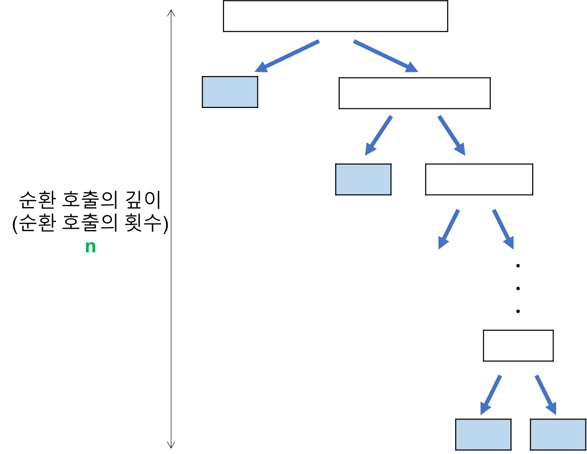

### 제자리 정렬(In-place sort)

- 추가적인 공간이 필요하지 않은 정렬
- 현재의 배열 안에서 정렬이 다 이루어 지는 것
- 버블 정렬, 선택 정렬, 삽입 정렬

### 안정 정렬(Stable Sort) vs 불안정 정렬

- **안정 정렬**
  - 중복된 값을 입력 순서와 동일하게 정렬하는 정렬 알고리즘의 특성
  - 원래 순서를 보장
  - 버블 정렬, 삽입 정렬, 합병 정렬
- **불안정 정렬**
  - 중복된 값이 입력 순서와 동일하지 않게 정렬되는 알고리즘
  - 원래 순서를 보장 X
  - 선택 정렬, 퀵 정렬, 힙 정렬

# 버블 정렬(Bubble Sort)

- 원소의 이동이 거품이 수면으로 올라오는 듯한 모습을 보이기 때문에 지어진 이름이다.
- 제자리 정렬(in-place sorting)
- 안정 정렬(Stable Sort)

### 알고리즘

- 배열의 두 수(a, b)를 선택한 뒤, 만약 그 두 수가 정렬되었다면 놔두고 아니라면 두 수를 바꾸는 방식으로 진행된다.
- 오름차순으로 정렬할 때는 a < b, 내림차순이라면 a > b여야 정렬된 것으로 판단한다.
- 이를 배열의 처음부터 끝까지 반복한다.

### 예시

- 초기의 정렬되지 않은 배열이 있다고 가정한다.
- 배열을 오름차순으로 정렬하고자 한다.

| 7   | 2   | 0   | 1   | 5   | 6   | 4   |
| --- | --- | --- | --- | --- | --- | --- |

- 배열의 첫 두 숫자(7, 2)를 비교한다.
- 7 > 2이므로 정렬되지 않았으니 두 수를 바꾼다.

| <2> | <7> | 0   | 1   | 5   | 6   | 4   |
| --- | --- | --- | --- | --- | --- | --- |

- 이를 배열의 처음부터 끝까지 작업하면 다음이 된다.

|  2  | <0> |   <7>   |    1    |    5    |    6    |    4    |
| :-: | :-: | :-----: | :-----: | :-----: | :-----: | :-----: |
|  2  |  0  | **<1>** | **<7>** |    5    |    6    |    4    |
|  2  |  0  |    1    | **<5>** | **<7>** |    6    |    4    |
|  2  |  0  |    1    |    5    | **<6>** | **<7>** |    4    |
|  2  |  0  |    1    |    5    |    6    | **<4>** | **<7>** |

1회 완료

- 가장 큰 수인 7이 정렬되었다.
- 이를 여러 번 반복한다면 다음과 같이 진행된다.

2회

|    2    |    0    |    1    |    5    |    6    |    4    |    7    |
| :-----: | :-----: | :-----: | :-----: | :-----: | :-----: | :-----: |
| **<0>** | **<2>** |    1    |    5    |    6    |    4    |    7    |
|    0    | **<1>** | **<2>** |    5    |    6    |    4    |    7    |
|    0    |    1    | **<2>** | **<5>** |    6    |    4    |    7    |
|    0    |    1    |    2    | **<5>** | **<6>** |    4    |    7    |
|    0    |    1    |    2    |    5    | **<4>** | **<6>** |    7    |
|    0    |    1    |    2    |    5    |    4    | **<6>** | **<7>** |

3회

|    0    |    1    |    2    |    5    |    4    |    6    |    7    |
| :-----: | :-----: | :-----: | :-----: | :-----: | :-----: | :-----: |
| **<0>** | **<1>** |    2    |    5    |    4    |    6    |    7    |
|    0    | **<1>** | **<2>** |    5    |    4    |    6    |    7    |
|    0    |    1    | **<2>** | **<4>** |    5    |    6    |    7    |
|    0    |    1    |    2    | **<4>** | **<5>** |    6    |    7    |
|    0    |    1    |    2    |    4    | **<5>** | **<6>** |    7    |
|    0    |    1    |    2    |    4    |    5    | **<6>** | **<7>** |

4회

| 0   | 1   | 2   | 4   | 5   | 6   | 7   |
| --- | --- | --- | --- | --- | --- | --- |

- 3회부터 4회까지는 아무 변화가 없으니 모두 정렬된 것으로 정의한다.

### 특징

- 장점
  - 구현이 간단하고 직관적이다.
  - 제자리 정렬(In-place sort) : 정렬 과정에서 다른 메모리 공간이 필요하지 않다.
  - 안정 정렬(Stable Sort)이다.
- 단점
  - 순서에 맞지 않는 요소를 인접한 요소와 교환한다.
  - 하나의 요소가 가장 왼쪽에서 가장 오른쪽으로 이동하려면 배열에서 모든 요소와 교환되어야 한다.
  - 특정 요소가 최종 위치에 있더라도 교환되는 일이 일어난다.
- 자료의 교환 작업(swap)이 이동 작업(move)보다 더 복잡하기 때문에 버블정렬은 단순하지만 거의 쓰이지 않는다.

### 시간 복잡도

- 비교 횟수
  - 최악(역순 정렬된 경우), 평균
    - n-1, n-2, ..., 2, 1번 = n(n-1)/2
  - 최선(이미 정렬된 경우)
    - '교환이 일어나지 않을 때'까지만 비교를 수행할 때 n번 비교
- 교환 횟수
  - 최악(역순 정렬된 경우)
    - 한 번 교환하기 위하여 3번의 이동이 필요하다.
    - (비교 횟수 \* 3)번 = 3n(n-1)/2
  - 최선(이미 정렬된 경우)
    - 자료이동이 발생하지 않는다.

|      |  비교  |  교환  |
| :--: | :----: | :----: |
| 최악 | O(n^2) | O(n^2) |
| 최선 |  O(n)  |  O(1)  |
| 평균 | O(n^2) | O(n^2) |

# 선택 정렬(Selection Sort)

- 해당 순서에 원소를 넣은 위치는 이미 정해져 있고, 어떤 원소를 넣을지 선택하는 알고리즘
  - 첫 번째 순서에는 첫 번째 위치에 가장 최소값을 넣는다.
  - 두 번째 순서에는 두 번째 위치에 남은 값 중에서의 최소값을 넣는다.
  - ...
- 제자리 정렬 알고리즘의 하나

### 알고리즘

1. 주어진 리스트 중에 최소값을 찾는다.
2. 그 값을 맨 앞에 위치한 값과 교체한다.(패스(pass))
3. 맨 처음 위치를 뺀 나머지 리스트를 같은 방법으로 교체한다.

### 예시

|    9    |    1    |    6    |    8    |    4    |    3    |    2    | [0] |
| :-----: | :-----: | :-----: | :-----: | :-----: | :-----: | :-----: | :-: |
| **<0>** |   [1]   |    6    |    8    |    4    |    3    |    2    |  9  |
|  **0**  | **<1>** |    6    |    8    |    4    |    3    |   [2]   |  9  |
|  **0**  |  **1**  | **<2>** |    8    |    4    |   [3]   |    6    |  9  |
|  **0**  |  **1**  |  **2**  | **<3>** |   [4]   |    8    |    6    |  9  |
|  **0**  |  **1**  |  **2**  |  **3**  | **<4>** |    8    |   [6]   |  9  |
|  **0**  |  **1**  |  **2**  |  **3**  |  **4**  | **<6>** |   [8]   |  9  |
|  **0**  |  **1**  |  **2**  |  **3**  |  **4**  |  **6**  | **<8>** |  9  |

### 특징

- 장점
  - 자료 이동 횟수가 미리 결정된다.
  - 제자리 정렬(In-place sort) : 정렬 과정에서 다른 메모리 공간이 필요하지 않다.
- 단점
  - 불안정 정렬이다.

### 시간 복잡도

- 비교 횟수
  - 두 개의 for 루프의 실행 횟수
  - 외부 루프 : (n-1)번
  - 내부 루프(최소값 찾기) : n-1, n-2, ..., 2, 1번
- 교환 횟수
  - 외부 루프의 실행 횟수와 동일, 즉 상수 시간 작업
  - 한 번 교환하기 위하여 3번의 이동이 필요하다.
  - (비교 횟수 \* 3)번 = 3n(n-1)/2

|      |  비교  | 교환 |
| :--: | :----: | :--: |
| 최악 | O(n^2) | O(n) |
| 최선 | O(n^2) | O(n) |
| 평균 | O(n^2) | O(n) |

### 개선 방법

- 이중 선택 정렬
  - 한 번의 탐색에서 최솟값과 최댓값을 같이 찾는 방법이다.
  - 탐색 횟수가 절반으로 줄어들게 된다.

# 삽입 정렬(Insertion Sort)

- 자료 배열의 모든 요소를 앞에서부터 차례대로 이미 정렬된 배열 부분과 비교하여, 자신의 위치를 찾아 삽입하는 알고리즘이다.
- 제자리 정렬 알고리즘의 하나

### 알고리즘

- k번째 반복 후의 결과 배열은, 앞쪽 k + 1 항목이 정렬된 상태이다.

| <=x | >x  | x   | Unsorted data |
| --- | --- | --- | ------------- |

- 각 반복에서 정렬되지 않은 나머지 부분 중 첫 번째 항목은 제거되어 정확한 위치에 삽입된다.

| <=x | x   | >x  | Unsorted data |
| --- | --- | --- | ------------- |

### 예시

|    31    |    25    |   12   |   22   |   11   | 처음 상태                                              |
| :------: | :------: | :----: | :----: | :----: | ------------------------------------------------------ |
|  **31**  |   [25]   |   12   |   22   |   11   | 두 번째 원소를 부분 리스트에서 적절한 위치에 삽입한다. |
| **<25>** |  **31**  |  [12]  |   22   |   11   | 세 번째 원소를 부분 리스트에서 적절한 위치에 삽입한다. |
| **<12>** |  **25**  | **31** |  [22]  |   11   | 네 번째 원소를 부분 리스트에서 적절한 위치에 삽입한다. |
|  **12**  | **<22>** | **25** | **31** |  [11]  | 마지막 원소를 부분 리스트에서 적절한 위치에 삽입한다.  |
| **<11>** |  **12**  | **22** | **25** | **31** | 종료.                                                  |

### 특징

- 장점
  - 구현이 간단하다.
  - 선택 정렬이나 거품 정렬과 같은 O(n2) 알고리즘에 비교하여 빠르다.
  - 안정 정렬이다.
  - 제자리 정렬(In-place sort) : 정렬 과정에서 다른 메모리 공간이 필요하지 않다.
- 단점
  - 배열이 길어질수록 효율이 떨어진다.

### 시간 복잡도

- 비교 횟수
  - 최악(역순 정렬된 경우), 평균
    - 외부 루프 안의 각 반복마다 i번의 비교 수행
    - 외부 루프: (n-1) + (n-2) + … + 2 + 1 = n(n-1)/2 = O(n^2)
  - 최선(이미 정렬된 경우)
    - 이동 없이 1번의 비교만 이루어진다.
    - 외부 루프: (n-1)번
- 교환 횟수
  - 최악(역순 정렬된 경우)
    - 외부 루프의 각 단계마다 (i+2)번의 이동 발생
    - n(n-1)/2 + 2(n-1) = (n^2+3n-4)/2 = O(n^2)
  - 최선(이미 정렬된 경우)
    - 자료이동이 발생하지 않는다.

|      |  비교  |  교환  |
| :--: | :----: | :----: |
| 최악 | O(n^2) | O(n^2) |
| 최선 |  O(n)  |  O(1)  |
| 평균 | O(n^2) | O(n^2) |

# 퀵정렬(Quick Sort)

- 다른 원소와의 비교만으로 정렬을 수행하는 비교 정렬에 속한다.
- 분할 정복 알고리즘의 하나로, 평균적으로 매우 빠른 수행 속도를 자랑하는 정렬 방법이다.

### 알고리즘

1. 리스트 가운데서 하나의 원소를 고른다. 이렇게 고른 원소를 **피벗**이라고 한다.
2. 피벗 앞에는 피벗보다 값이 작은 모든 원소들이 오고, 피벗 뒤에는 피벗보다 값이 큰 모든 원소들이 오도록 피벗을 기준으로 리스트를 둘로 나눈다. 이렇게 리스트를 둘로 나누는 것을 **분할**이라고 한다. 분할을 마친 뒤에 피벗은 더 이상 움직이지 않는다.
3. 분할된 두 개의 작은 리스트에 대해 **재귀(Recursion)적**으로 이 과정을 반복한다. 재귀는 리스트의 크기가 0이나 1이 될 때까지 반복된다.

- 재귀 호출이 한번 진행될 때마다 최소한 하나의 원소는 최종적으로 위치가 정해지므로, 이 알고리즘은 반드시 끝난다는 것을 보장할 수 있다.

### 예시

- 임의의 pivot 값을 기준으로 pivot의 좌측에는 pivot보다 작은값, 우측에는 pivot 보다 큰 값을 두고자 한다.
- 피벗은 p, 리스트 왼쪽 끝과 오른쪽 끝에서 시작한 인덱스들을 i, j라고 하자.

| 5   | 3   | 7   | 6   | 2   | 1   | 4   |
| --- | --- | --- | --- | --- | --- | --- |
| i   |     |     |     |     | j   | p   |

- 리스트 왼쪽에 있는 i 위치의 값이 피벗 값보다 크고, 오른쪽에 있는 j 위치의 값은 피벗 값보다 작으므로 둘을 교환한다.

| 1   | 3   | 7   | 6   | 2   | 5   | 4   |
| --- | --- | --- | --- | --- | --- | --- |
| i   |     |     |     |     | j   | p   |

- j 위치의 값이 피벗 값보다 작지만, i 위치의 값도 피벗값보다 작으므로 교환하지 않는다.

| 1   | 3   | 7   | 6   | 2   | 5   | 4   |
| --- | --- | --- | --- | --- | --- | --- |
|     | i   |     |     | j   |     | p   |

- i 위치를 피벗 값보다 큰 값이 나올 때까지 진행해 j 위치의 값과 교환한다.

| 1   | 3   | 7     | 6   | 2     | 5   | 4   |
| --- | --- | ----- | --- | ----- | --- | --- |
|     |     | i     |     | j     |     | p   |
| 1   | 3   | **2** | 6   | **7** | 5   | 4   |
|     |     | i     |     | j     |     | p   |

- i위치가 j 위치보다 커지면, i 위치의 값과 피벗 값을 교환한다.

| 1   | 3   | 2   | 6     | 7   | 5   | 4     |
| --- | --- | --- | ----- | --- | --- | ----- |
|     |     |     |       |     |     | p     |
| 1   | 3   | 2   | **4** | 7   | 5   | **6** |
|     |     |     | p     |     |     |       |

- 피벗 값 좌우의 리스트에 대해 각각 퀵 정렬을 재귀적으로 수행한다.

| 1   | 3   | 2   | 4   | 7   | 5   | 6   |
| --- | --- | --- | --- | --- | --- | --- |
|     |     |     | p   |     |     |     |

| 1   | 3   | 2   |
| --- | --- | --- |
| 1   | 2   | 3   |

| 7   | 5   | 6   |
| --- | --- | --- |
| 5   | 6   | 7   |

- 완성된 리스트는 다음과 같다.

| 1   | 2   | 3   | 4   | 5   | 6   | 7   |
| --- | --- | --- | --- | --- | --- | --- |

### 특징

- 장점
  - 시간 복잡도가 O(nlog₂n)를 가지는 다른 정렬 알고리즘과 비교했을 때도 가장 빠르다.
    - 퀵 정렬이 불필요한 데이터의 이동을 줄이고 먼 거리의 데이터를 교환할 뿐만 아니라, 한 번 결정된 피벗들이 추후 연산에서 제외되는 특성 때문이다.
  - 제자리 정렬(In-place sort) : 정렬 과정에서 다른 메모리 공간이 필요하지 않다.
- 단점
  - 불안정 정렬이다.

### 시간 복잡도

- 최악
  - 리스트가 계속 불균형하게 나누어지는 경우
  - 특히, **이미 정렬된 리스트**에 대하여 퀵 정렬을 실행하는 경우
  - 비교 횟수
    - 순환 호출의 깊이
      - 레코드의 개수 n이 2의 거듭제곱이라고 가정(n=2^k)했을 때, 순환 호출의 깊이는 n
      - n
    - 각 순환 호출 단계의 비교 연산
      - 각 순환 호출에서는 전체 리스트의 대부분의 레코드를 비교해야 하므로 평균 n번 정도의 비교가 이루어진다.
      - 평균 n번
    - 순환 호출의 깊이 \* 각 순환 호출 단계의 비교 연산 = n^2
  - 이동 횟수
    - 비교 횟수보다 적으므로 무시할 수 있다.

- 최선
  - 비교 횟수
    - 순환 호출의 깊이
      - 레코드의 개수 n이 2의 거듭제곱이라고 가정(n=2^k)했을 때, n=2^3의 경우, 2^3 -> 2^2 -> 2^1 -> 2^0 순으로 줄어들어 순환 호출의 깊이가 3임을 알 수 있다. 이것을 일반화하면 n=2^k의 경우, k=log₂n
      - k=log₂n
    - 각 순환 호출 단계의 비교 연산
      - 각 순환 호출에서는 전체 리스트의 대부분의 레코드를 비교해야 하므로 평균 n번 정도의 비교가 이루어진다.
      - 평균 n번
    - 순환 호출의 깊이 \* 각 순환 호출 단계의 비교 연산 = nlog₂n
  - 이동 횟수
    - 비교 횟수보다 적으므로 무시할 수 있다..

- 평균
  - nlog₂n

| 최악 |   O(n^2)   |
| :--: | :--------: |
| 최선 | O(n log n) |
| 평균 | O(n log n) |

### 개선 방법

- 퀵 정렬에서 피벗 위치를 결정하는 방법
  - 난수 분할 사용 : 안정성이 떨어진다.
  - 세 값(좌측 끝, 중앙, 우측 끝)의 중위법을 이용 : 중앙에서 분할될 가능성이 높아 전체적으로 정렬의 성능이 좋아진다.

# 합병 정렬(Merge Sort)

- 존 폰 노이만이 개발한 정렬 알고리즘이다.
- 분할 정복 알고리즘의 하나이다.

### 알고리즘

- **n-way 합병 정렬**

1. 정렬되지 않은 리스트를 각각 하나의 원소만 포함하는 n개의 부분리스트로 분할한다. (한 원소만 든 리스트는 정렬된 것과 같으므로)
2. 부분리스트가 하나만 남을 때까지 반복해서 병합하며 정렬된 부분리스트를 생성한다. 마지막 남은 부분리스트가 정렬된 리스트이다.

- **하향식 2-way 합병 정렬**

1. 리스트의 길이가 1 이하이면 이미 정렬된 것으로 본다. 그렇지 않은 경우에는
2. 분할(divide): 정렬되지 않은 리스트를 절반으로 잘라 비슷한 크기의 두 부분 리스트로 나눈다.
3. 정복(conquer): 각 부분 리스트를 재귀적으로 합병 정렬을 이용해 정렬한다.
4. 결합(combine): 두 부분 리스트를 다시 하나의 정렬된 리스트로 합병한다. 이때 정렬 결과가 임시배열에 저장된다.
5. 복사(copy): 임시 배열에 저장된 결과를 원래 배열에 복사한다.

### 예시

| 초기상태 |     |     |     |     |     |     |     | [   | 6   | 5   | 3   | 1   | 8   | 7   | 2   | 4   | ]   |     |     |     |     |     |     |     |
| -------- | --- | --- | --- | --- | --- | --- | --- | --- | --- | --- | --- | --- | --- | --- | --- | --- | --- | --- | --- | --- | --- | --- | --- | --- |
| 분할     |     |     |     | [   | 6   | 5   | 3   | 1   | ]   |     |     |     |     |     |     | [   | 8   | 7   | 2   | 4   | ]   |     |     |     |
| 분할     |     | [   | 6   | 5   | ]   |     |     | [   | 3   | 1   | ]   |     |     | [   | 8   | 7   | ]   |     |     | [   | 2   | 4   | ]   |     |
| 분할     | [   | 6   | ]   | [   | 5   | ]   | [   | 3   | ]   | [   | 1   | ]   | [   | 8   | ]   | [   | 7   | ]   | [   | 2   | ]   | [   | 4   | ]   |
| 정복결합 |     | [   | 5   | 6   | ]   |     |     | [   | 1   | 3   | ]   |     |     | [   | 7   | 8   | ]   |     |     | [   | 2   | 4   | ]   |     |
| 정복결합 |     |     |     | [   | 1   | 3   | 5   | 6   | ]   |     |     |     |     |     |     | [   | 2   | 4   | 7   | 8   | ]   |     |     |     |
| 정복결합 |     |     |     |     |     |     |     | [   | 1   | 2   | 3   | 4   | 5   | 6   | 7   | 8   | ]   |     |     |     |     |     |     |     |

### 특징

- 장점
  - 데이터의 분포에 영향을 덜 받는다. 즉, 입력 데이터가 무엇이든 간에 정렬되는 시간은 동일하다. (O(nlog₂n)로 동일)
  - 만약 레코드를 연결 리스트(Linked List)로 구성하면, 링크 인덱스만 변경되므로 데이터의 이동은 무시할 수 있을 정도로 작아진다.
    - 제자리 정렬(in-place sorting)로 구현할 수 있다.
  - 안정 정렬이다.
- 단점
  - 만약 레코드를 배열(Array)로 구성하면, 임시 배열이 필요하다.
    - 제자리 정렬(in-place sorting)이 아니다.
  - 레크드들의 크기가 큰 경우에는 이동 횟수가 많으므로 매우 큰 시간적 낭비를 초래한다.

### 시간 복잡도

- 분할 단계
  - 비교 연산과 이동 연산이 수행되지 않는다.
- 합병 단계
  - 순환 호출의 깊이 (합병 단계의 수)
    - 레코드의 개수 n이 2의 거듭제곱이라고 가정(n=2^k)했을 때, n=2^3의 경우, 2^3 -> 2^2 -> 2^1 -> 2^0 순으로 줄어들어 순환 호출의 깊이가 3임을 알 수 있다. 이것을 일반화하면 n=2^k의 경우, k(k=log₂n)임을 알 수 있다.
    - k=log₂n
  - 각 합병 단계의 비교 연산
    - 크기 1인 부분 배열 2개를 합병하는 데는 최대 2번의 비교 연산이 필요하고, 부분 배열의 쌍이 4개이므로 24=8번의 비교 연산이 필요하다.
    - 다음 단계에서는 크기 2인 부분 배열 2개를 합병하는 데 최대 4번의 비교 연산이 필요하고, 부분 배열의 쌍이 2개이므로 42=8번의 비교 연산이 필요하다.
    - 마지막 단계에서는 크기 4인 부분 배열 2개를 합병하는 데는 최대 8번의 비교 연산이 필요하고, 부분 배열의 쌍이 1개이므로 8\*1=8번의 비교 연산이 필요하다.
    - 이것을 일반화하면 하나의 합병 단계에서는 최대 n번의 비교 연산을 수행함을 알 수 있다.
    - 최대 n번
  - 순환 호출의 깊이 만큼의 합병 단계 \* 각 합병 단계의 비교 연산 = nlog₂n

| 최악 | O(n log n) |
| :--: | :--------: |
| 최선 | O(n log n) |
| 평균 | O(n log n) |

# 힙 정렬

- 최대 힙 트리나 최소 힙 트리를 구성해 정렬을 하는 방법이다.
- 내림차순 정렬을 위해서는 최소 힙을 구성하고 오름차순 정렬을 위해서는 최대 힙을 구성하면 된다.

### 알고리즘

1. n개의 노드에 대한 완전 이진 트리를 구성한다. 이때 루트 노드부터 부모노드, 왼쪽 자식노드, 오른쪽 자식노드 순으로 구성한다.
2. 최대 힙을 구성한다. 최대 힙이란 부모노드가 자식노드보다 큰 트리를 말하는데, 단말 노드를 자식노드로 가진 부모노드부터 구성하며 아래부터 루트까지 올라오며 순차적으로 만들어 갈 수 있다.
3. 가장 큰 수(루트에 위치)를 가장 작은 수와 교환한다.
4. 2와 3을 반복한다.

### 예시

- 가장 작은 것부터 가장 큰 것까지 정렬하고 싶은 리스트 { 6, 5, 3, 1, 8, 7, 2, 4 }
- 생성

| 힙                             |            Unsorted | 교체 요소 |
| ------------------------------ | ------------------: | :-------: |
| 6                              | 5, 3, 1, 8, 7, 2, 4 |           |
| **6**, **5**                   |    3, 1, 8, 7, 2, 4 |           |
| **6**, 5, **3**                |       1, 8, 7, 2, 4 |           |
| 6, **5**, 3, **1**             |          8, 7, 2, 4 |           |
| 6, **5**, 3, 1, **8**          |             7, 2, 4 |   5 ⇔ 8   |
| **6**, **8**, 3, 1, 5          |             7, 2, 4 |   6 ⇔ 8   |
| **8**, 6, 3, 1, 5              |             7, 2, 4 |           |
| 8, 6, **3**, 1, 5, **7**       |                2, 4 |   3 ⇔ 7   |
| **8**, 6, **7**, 1, 5, 3       |                2, 4 |           |
| 8, 6, **7**, 1, 5, 3, **2**    |                   4 |           |
| 8, 6, 7, **1**, 5, 3, 2, **4** |                     |   1 ⇔ 4   |
| 8, **6**, 7, **4**, 5, 3, 2, 1 |

- 정렬

| 힙                     |           Sorted array | 교체 요소 | 내용                              |
| ---------------------- | ---------------------: | :-------: | --------------------------------- |
| 8, 6, 7, 4, 5, 3, 2, 1 |                        |   8 ↔ 1   | 8을 1과 바꿔서 정렬된 배열에 추가 |
| 1, 6, 7, 4, 5, 3, 2    |                      8 |   1 ↔ 7   | 1과 7을 순서에 맞게 교환          |
| 7, 6, 1, 4, 5, 3, 2    |                      8 |   1 ↔ 3   | 1과 3을 순서에 맞게 교환          |
| 7, 6, 3, 4, 5, 1, 2    |                      8 |           | 1은 자식이 없음; siftDown 완료    |
| 7, 6, 3, 4, 5, 1, 2    |                      8 |   7 ↔ 2   | 7을 2와 바꿔서 정렬된 배열에 추가 |
| 2, 6, 3, 4, 5, 1       |                   7, 8 |   2 ↔ 6   | 2와 6을 순서에 맞게 교환          |
| 6, 2, 3, 4, 5, 1       |                   7, 8 |   2 ↔ 5   | 2와 5를 순서에 맞게 교환          |
| 6, 5, 3, 4, 2, 1       |                   7, 8 |           | 2는 자식이 없음; siftDown 완료    |
| 6, 5, 3, 4, 2, 1       |                   7, 8 |   6 ↔ 1   | 6을 1과 바꿔서 정렬된 배열에 추가 |
| 1, 5, 3, 4, 2          |                6, 7, 8 |   1 ↔ 5   | 1과 5를 순서에 맞게 교환          |
| 5, 1, 3, 4, 2          |                6, 7, 8 |   1 ↔ 4   | 1과 4를 순서에 맞게 교환          |
| 5, 5, 3, 1, 2          |                6, 7, 8 |           | 1은 자식이 없음; siftDown 완료    |
| 5, 4, 3, 1, 2          |                6, 7, 8 |   5 ↔ 2   | 5와 2와 바꿔서 정렬된 배열에 추가 |
| 2, 4, 3, 1             |             5, 6, 7, 8 |   2 ↔ 4   | 2와 4를 순서에 맞게 교환          |
| 4, 2, 3, 1             |             5, 6, 7, 8 |           | 2가 1보다 큼; siftDown 완료       |
| 4, 2, 3, 1             |             5, 6, 7, 8 |           | 4를 1과 바꿔서 정렬된 배열에 추가 |
| 1, 2, 3                |          4, 5, 6, 7, 8 |   1 ↔ 3   | 1과 3을 순서에 맞게 교환          |
| 3, 2, 1                |          4, 5, 6, 7, 8 |           | 1은 자식이 없음; siftDown 완료    |
| 3, 2, 1                |          4, 5, 6, 7, 8 |   1 ↔ 3   | 3을 1과 바꿔서 정렬된 배열에 추가 |
| 1, 2                   |       3, 4, 5, 6, 7, 8 |   1 ↔ 2   | 1과 2를 순서에 맞게 교환          |
| 2, 1                   |       3, 4, 5, 6, 7, 8 |           | 1은 자식이 없음; siftDown 완료    |
| 2, 1                   |       3, 4, 5, 6, 7, 8 |   2 ↔ 1   | 2와 1과 바꿔서 정렬된 배열에 추가 |
| 1                      |    2, 3, 4, 5, 6, 7, 8 |           | 1을 정렬된 배열에 추가            |
|                        | 1, 2, 3, 4, 5, 6, 7, 8 |           | 완료                              |

### 특징

- 장점
  - 힙 정렬이 가장 유용한 경우는 전체 자료를 정렬하는 것이 아니라 가장 큰 값 몇개만 필요할 때이다.

### 시간 복잡도

- 힙 트리의 전체 높이가 거의 log₂n(완전 이진 트리이므로)이므로 하나의 요소를 힙에 삽입하거나 삭제할 때 힙을 재정비하는 시간이 log₂n만큼 소요된다.
- 요소의 개수가 n개 이므로 전체적으로 O(nlog₂n)의 시간이 걸린다.

| 최악 | O(n log n) |
| :--: | :--------: |
| 최선 | O(n log n) |
| 평균 | O(n log n) |
