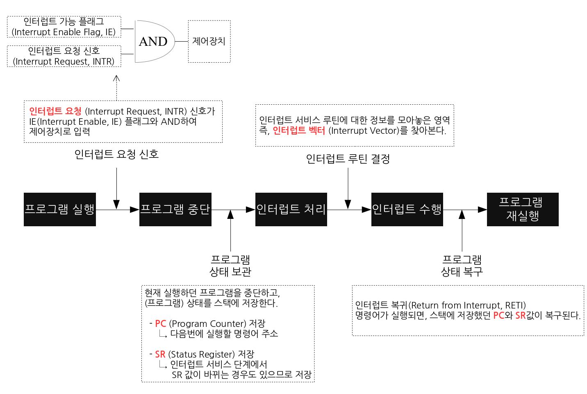

# 인터럽트(Interrupt)

- 프로세스 실행 도중 예기치 않은 상황이 발생할 때 발생한 상황을 처리한 후 실행 중인 작업으로 복귀하는 것을 말한다.
- CPU를 최대한 낭비하지 않도록 하기 위해서 사용하기 위해 존재한다.
- 인터럽트가 없다면 CPU에 wait 상태가 발생하여 다른 연산을 할 수 없어 CPU가 낭비된다.

## 과정

1. 작업을 처리 중, 인터럽트가 발생
2. 현재 처리 중인 일을 중지
3. 현재 컴퓨터의 상태(CPU 내부의 레지스터, 메인 메모리 내용 등)를 저장
4. 해당하는 인터럽트를 처리해주기 위한 인터럽트 서비스 루틴을 처리
5. 인터럽트 처리 이후 저장되었던 이전 작업의 상태를 복구
6. 이전 작업 수행을 재개

## 종류

### 외부 인터럽트

- 입출력 장치, 타이밍 장치, 전원 등의 외부적인 요인에 의해서 발생하는 인터럽트
  - 타이머 인터럽트 : 타이머가 일정한 시간 간격으로 중앙처리장치에게 인터럽트를 요청
  - 입출력 인터럽트 : 속도가 느린 입출력장치가 입출력 준비가 완료되었음을 알리기 위해 인터럽트를 요청
  - 전원 이상 인터럽트 : 정전이나 전원이 이상이 있는 경우
  - 기계 고장 인터럽트 : CPU등의 기능적인 동작 오류가 발생한 경우

### 내부 인터럽트

- 잘못된 명령이나 데이터를 사용할 때 발생하는 인터럽트
  - 0으로 나누는 경우
  - 오버플로우 또는 언더플로우가 발생한 경우
  - 프로그램 상의 오류
  - 프로그램에서 함수 등 명령어를 잘못 사용한 경우
  - 소프트웨어 인터럽트: CPU가 명령을 수행하는 도중에 일어나는 인터럽트

# 인터럽트 서비스 루틴(Interrupt Service Routine; ISR)

- = 인터럽트 핸들러(interrupt handler)
- 실제 인터럽트를 처리하기 위한 인터럽트에 대응하여 특정 기능을 처리하는 기계어 코드 루틴
- 운영체제의 코드 영역에는 인터럽트별로 처리해야할 내용이 이미 프로그램되어있다.

# 인터럽트 vs 트랩

- 트랩(Trap) : 어떤 프로세스가 특정 시스템 기능을 사용하려고 할 때 그 기능을 운영체제에게 요청하는 방법

| 인터럽트                                                 | 트랩                                                    |
| -------------------------------------------------------- | ------------------------------------------------------- |
| 하드웨어적                                               | 소프트웨어적                                            |
| 장치 폴링 문제 해결을 위해 입출력장치의 완료 신호로 사용 | 운영체제 루틴을 호출하거나, 산술 오류를 잡아내는데 사용 |
