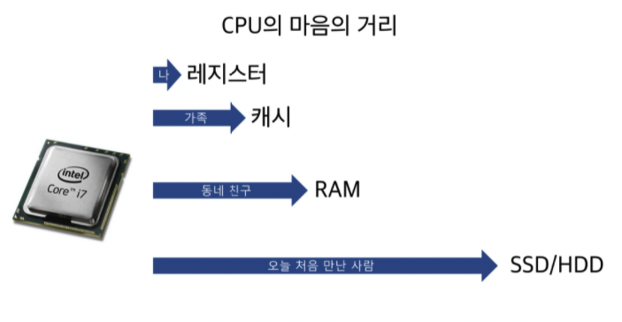
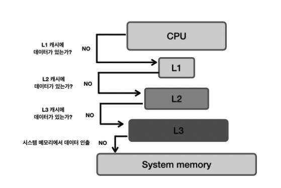
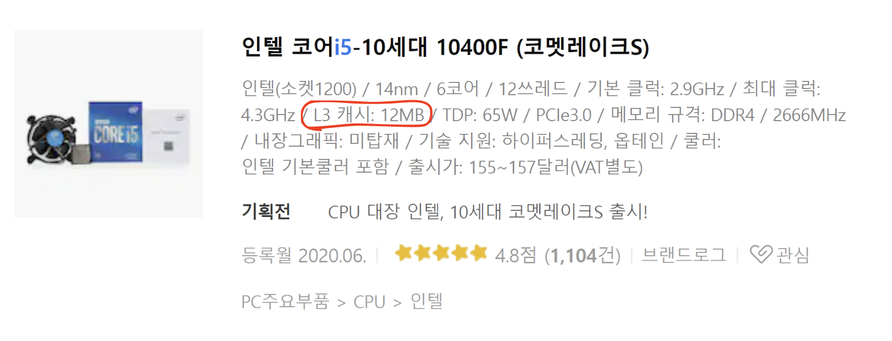

# 메모리 (Memory)
**CPU가 직접 접근할 수 있는 기억장치**

프로세스가 실행되려면 프로그램이 메모리에 올라와야한다.

프로그램 실행 시 필요한 주소, 정보들을 저장하고 가져다 사용할 수 있게 만드는 공간

> CPU(Central Processing Unit, 중앙처리장치): 하드웨어 구성 요소 중 하나로, 컴퓨터에서 프로그램을 실행하는 데 필요한 연산을 처리하고 수행합니다. `Processor`라고도 불립니다. 

## 1. 메모리의 특징

- **지역성** : 데이터 접근이 시간적, 혹은 공간적으로 가깝게 일어나는 것
  - **시간적 지역성(Temporal locality)** : 특정 데이터가 한 번 접근되었을 경우,가까운 미래에 또 한 번 데이터에 접근할 가능성이 높음
  - **공간적 지역성(Spatial locality)** : 액세스 된 기억장소와 인접한 기억장소가 액세스 될 가능성이 높음
- 지역성 원리를 이용하여 계층으로 구성됨
  - 위로 갈수록 접근시간 감소, 속도 증가, 비용 비쌈, 용량 적음
- 성능 결정 요인 : 기억용량(capacity), 접근시간(access time), 사이클 시간(cycle time), 기억장치 대역포(bandwidth), 가격(cost)

## 2. 메모리 계층 = 기억장치 계층

✔ 세 가지 주요 특성인 **용량, 접근속도, 비용** 간의 절충 관계를 파악해 필요에 따라 채택할 수 있게 나타낸 구조

    

    

- 메모리를 필요에 따라 여러 종류로 나누면 **CPU가 메모리에 더 빨리 접근** 가능함
- 각각의 특징이 있는 서로 다른 종류의 저장 장치를 함께 사용하여 **최적의 효율**을 낼 수 있음

| 명칭                                  | 위치               | 접근 속도 | 기억 용량 | 휘발성 여부 |
| ------------------------------------- | ------------------ | --------- | --------- | ----------- |
| 레지스터                              | CPU 내부           | 가장 빠름 | 가장 적음 | 휘발성      |
| 캐시                                  | CPU 내부           | 빠름      | 적음      | 휘발성      |
| 메모리(RAM, 주기억장치)               | CPU 외부           | 보통      | 보통      | 휘발성      |
| 하드 디스크(SSD or HDD, 보조기억장치) | CPU 직접 접근 불가 | 낮음      | 많음      | 비휘발성    |

>하드디스크의 경우 데이터를 메모리로 이동시켜 접근가능하기 때문에 속도가 낮음

### 1) 레지스터(Register) 

- **CPU가 요청을 처리하는 데 필요한 데이터를 일시적으로 저장하는 기억장치**
  - CPU는 자체적으로 데이터를 저장할 방법이 없으므로 메모리로 직접 데이터를 전송할 수 없음
  - → **연산을 위해서 반드시 레지스터를 거쳐야 하며**, 이를 위해 레지스터는 **특정 주소를 가리키거나 값을 읽어올 수 있음**
- 프로세서에 위치한 고속 메모리로, **프로세스가 바로 사용할 수 있는 데이터(소량의 데이터, 처리 중인 중간 결과 등)를 담고 있는 영역**

#### [ CPU 내부 레지스터 종류 ]

| 종류                                               | 설명                                                         |
| -------------------------------------------------- | ------------------------------------------------------------ |
| 프로그램 계수기(PC, Program Counter)               | 다음에 실행할 명령어(instruction)의 주소를 가지고 있는 레지스터 |
| 누산기(AC, ACcumulator)                            | 연산 결과 데이터를 일시적으로 저장하는 레지스터              |
| 명령어 레지스터(IR, Instruction Register)          | 현재 수행 중인 명령어를 가지고 있는 레지스터                 |
| 상태 레지스터(SR, Status Register)                 | 현재 CPU의 상태를 가지고 있는 레지스터                       |
| 메모리 주소 레지스터(MAR, Memory Address Register) | 메모리로부터 읽어오거나 메모리에 쓰기 위한 주소를 가지고 있는 레지스터 |
| 메모리 버퍼 레지스터(MBR, Memory Buffer Register)  | 메모리로부터 읽어온 데이터 또는 메모리에 써야할 데이터를 가지고 있는 레지스터 |
| 입출력 주소 레지스터(I/O AR, I/O Address Register) | 입출력 장치에 따른 입출력 모듈의 주소를 가지고 있는 레지스터 |
| 입출력 버퍼 레지스터(I/O BR, I/O Buffer Register)  | 입출력 모듈과 프로세서 간의 데이터 교환을 위해 사용되는 레지스터 |

### 2) 캐시(Cache) 

**사용되었던 데이터는 다시 사용되어질 가능성이 높다**는 개념을 이용하여 데이터나 값을 **미리 복사해 놓는 임시 장소**

    

- **중앙처리장치와 주기억장치 간의 속도 차이 개선을 목적**
- **시스템의 효율성**을 위해 사용
  - 캐시의 접근 시간에 비해 원래 데이터를 접근하는 시간이 오래 걸리는 경우
  - 값을 다시 계산하는 시간을 절약하고 싶은 경우
- 속도가 빠른 장치와 느린 장치 사이에서 속도차에 따른 **병목 현상을 완화**하기 위한 범용 메모리

> 캐싱(Caching) : 캐시(Cache)라고 하는 좀 더 빠른 메모리 영역으로 데이터를 가져와서 접근하는 방식

#### [ 종류 ]

- CPU 캐시
  - 대용량의 메인 메모리 접근을 빠르게 하기 위해 CPU 칩 내부나 바로 옆에 탑재하는 작은 메모리
  - 하드웨어를 통해 관리

    

| 종류    | 설명                                                         | CPU 성능에 직접적인 영향 |
| ------- | ------------------------------------------------------------ | ------------------------ |
| L1 캐시 | 일반적으로 CPU 칩안에 내장되어 데이터 사용 및 참조에 가장 먼저 사용되는 캐시 메모리 | O                        |
| L2 캐시 | - L1 캐시 메모리와 용도와 역할이 비슷  - 속도 : L1 캐시 > L2 캐시 > 일반메모리(RAM) | O                        |
| L3 캐시 | - L1 캐시, L2 캐시와 동일한 원리로 작동  - 대부분 CPU가 아닌 메인보드에 내장 | X                        |

    

- 디스크 캐시(=디스크 버퍼) :
  - 하드 디스크에 내장된 작은 컴퓨터(기능 : 디스크 제어, 외부와의 인터페이스)가 소유한 작은 메모리(디스크에 입출력되는 데이터를 저장하는 작은 메모리)
  - 일종의 기법(하드디스크와 RAM 사이 존재)
- 그 외
  - 소프트웨어적으로 관리
  - 페이지 캐시 : 운영체제의 메인 메모리를 하드 디스크에 복사해 놓는 캐시 ex) 웹 페이지 캐시

### 3) 메인 메모리 (Main Memory) 

- **주 기억장치**
- 컴퓨터에서 수치·명령·자료 등을 기억하는 컴퓨터 하드웨어 장치
- **RAM(Random Access Memory)** : **휘발성** 기억 장치
  - 빠른 액세스를 위해 데이터를 단기간 저장하는 구성 요소
  - 사용자가 요청하는 프로그램이나 문서를 스토리지 디스크에서 메모리로 로드하여 각각의 정보에 액세스
  - 전원이 유지되는 동안 CPU의 연산 및 동작에 필요한 모든 내용이 저장
  - 전원 종료시 기억된 내용 삭제
  - `Random Access` : 어느 위치에서든 똑같은 속도로 접근하여 읽고 쓸 수 있다는 의미
  - DRAM과 SRAM이 있는데 주기억장치는 주로 DRAM을 의미한다. (SRAM은 캐시나 레지스터)

> **DRAM과 SRAM이란?**
>
> DRAM - Dynamic RAM
>
> - 동적 메모리
> - 전원이 계속 공급되더라도 주기적으로 재충전되어야 기억된 내용을 유지할 수 있다.
> - 주로 대용량의 기억장치에 사용되며 가격이 저렴하다.
> - 주로 RAM이라고 표현하는 것(주기억장치)은 거의 DRAM을 칭하는 것이다.
>
> SRAM - Static RAM
>
> - 정적 메모리
> - 전원 공급이 되는 동안은 기록된 내용이 지워지지 않기 때문에 재충전이 필요없다.
> - 접근 속도가 빠르고 가격이 비싸다는 특징이 있으며 주로 캐시메모리나 레지스터로 사용된다.

- **ROM(Read Only Memory)** : **고정 기억** 장치
  - 컴퓨터에 지시사항을 영구히 저장하는 **비휘발성** 메모리
  - 전원 종료시 기억된 내용 유지
  - 변경 가능성이 희박한 기능 및 부품에 사용
    - 소프트웨어 : 초기 부팅 관련 부분
    - 하드웨어 : 프린터 작동에 관여하는 펌웨어 명령 등
  - ROM은 주기억장치로 사용되기보다는 주로 기본 입,출력 시스템(BIOS), 자가 진단 프로그램(POST)같은 변경 가능성이 희박한 시스템 소프트웨어를 기억시키는데 이용한다.

### 4) 보조 기억장치 (Auxiliary Memory, Secondary Memory) 

물리적 디스크가 연결되어 있는 기억장치

- **HDD(Hard Disk Drive), SSD(Solid State Drive)**
- 컴퓨터 전원을 꺼도 저장된 데이터가 사라지지 않음(**비휘발성**)
- 중앙처리장치와 직접 자료 교환 불가능
- 접근시간이 오래 걸림
- CPU 직접 접근 불가

## 3. 메모리 계층 구조의 존재 이유

### 1) 더 빠른 접근과 처리 속도 증가

* 우리는 보통 많이 쓰는 것을 다시 많이 씁니다.
  * 즉, **자주 쓰이는 데이터는 계속 자주 쓰이고, 자주 쓰이지 않는 데이터는 계속 자주 쓰이지 않습니다.**

* 이러한 특성 때문에 특정 데이터에 많이 접근하게 되는데 좀 더 작은 캐시 메모리에 해당 데이터가 있다면 더 빠르게 해당 데이터에 접근이 가능합니다.
* 이로 인해 처리 속도도 증가하게 됩니다.

### 2) 비용의 효율성

* 캐시 메모리는 비싸고 RAM 등 아래로 갈수록 비용은 더 저렴합니다. 
* 비싼 하드웨어는 꼭 필요한 만큼의 크기만 사용할 수 있으며,
* 싼 하드웨어를 넉넉한 크기만큼 사용할 수 있습니다.

### 3) 자원의 효율적인 사용

* 메모리 계층 구조는 자주 접근하는 데이터는 빠른 메모리에, 덜 접근하는 데이터는 느린 메모리에 저장하여 자원을 효율적으로 사용할 수 있습니다.
* 이렇게 하면 거의 접근하지 않은 데이터에 비싸고 빠른 메모리를 사용하지 않게 되어 자원을 낭비하지 않게 됩니다.

---

### ❓ 예상 질문

Q1. 만약 필요한 데이터가 하드디스크에 있다면, CPU에서 바로 하드디스크에 접근해서 데이터를 가져오면 더 빠를텐데 왜 굳이 모든 계층구조를 모두 통해서 가져올까요?

* A1. CPU의 속도에 비해 하드디스크의 속도가 너무 느리기 때문입니다. 하드디스크는 대량의 데이터를 저장하기에는 적합하지만, 데이터 접근 속도가 느리기 때문에, 실시간으로 빠른 처리가 필요한 CPU 작업에는 부적합합니다. 반면, RAM은 훨씬 빠른 접근 속도를 제공합니다. CPU가 필요한 데이터를 처리할 때, RAM에서 이를 빠르게 가져올 수 있기 때문에, 전체적인 시스템의 성능이 크게 향상됩니다. 이러한 계층적 메모리 구조는 데이터 처리의 속도를 최적화하고, CPU가 불필요한 대기 시간 없이 효율적으로 작동할 수 있도록 돕습니다.

Q2. RAM을 주기억장치라고 표현하는 이유는?

Q3. 왜 불편하게 전원이 차단되면 모든 기억된 내용이 지워지는 휘발성 장치를 사용할까요?

### 📖 참고 자료

면접을 위한 CS 전공지식 노트

[[OS] 메모리 계층 구조(Memory Hierachy)](https://velog.io/@yu-jin-song/CS-%EB%A9%94%EB%AA%A8%EB%A6%AC-%EA%B3%84%EC%B8%B5-%EA%B5%AC%EC%A1%B0)

[메모리 계층구조](https://velog.io/@steadygo247/%EB%A9%94%EB%AA%A8%EB%A6%AC-%EA%B3%84%EC%B8%B5%EA%B5%AC%EC%A1%B0)

[[컴퓨터의 메모리구조] 캐시,메모리,디스크의 차이](https://sujinhope.github.io/2020/03/13/%EC%BB%B4%ED%93%A8%ED%84%B0%EC%9D%98-%EB%A9%94%EB%AA%A8%EB%A6%AC%EA%B5%AC%EC%A1%B0-%EC%BA%90%EC%8B%9C,%EB%A9%94%EB%AA%A8%EB%A6%AC,%EB%94%94%EC%8A%A4%ED%81%AC%EC%9D%98-%EC%B0%A8%EC%9D%B4.html)

[메모리 계층 구조 정리](https://github.com/devSquad-study/2023-CS-Study/blob/main/OS/os_memory_hierarchy.md)
