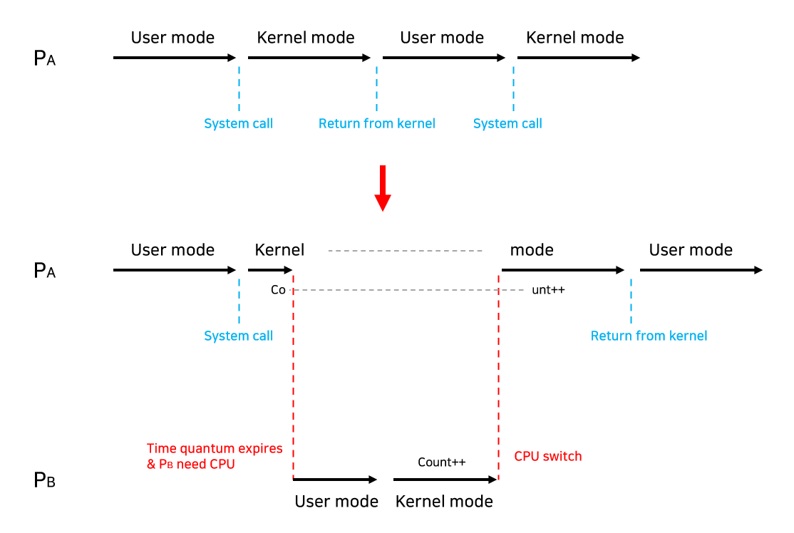

# 프로세스 동기화(Process Synchronization)

- 두 개 이상의 프로세스가 공유 데이터(shared data)에 동시 접근(concurrent access)할 때 데이터의 불일치 문제(inconsistency)를 발생시킬 수 있기 때문에 일관성(consistency) 유지를 위한 협력 프로세스(cooperating process) 간의 실행 순서(orderly execution)를 정해주는 메커니즘이다.
- 임계 영역에 두 개 이상의 프로세스/스레드가 접근했을 때 발생할 수 있는 문제

## 임계 영역(Critical Section)

- 둘 이상의 프로세스 또는 스레드가 공유 자원에 접근할 때 순서 등의 이유로 결과가 달라질 수 있는 코드 영역
- 한 번에 하나의 프로세스나 스레드만 접근할 수 있는 코드 영역

### 구조

```
while(true) {
    entry section       // 공유 데이터에 접근 전에 lock
        critical section    // 공유 데이터를 접근하는 코드
    exit section        // 끝나면 unlock
        remainder section
}
```

- 한 프로세스가 critical section에 접근하고자 했지만 다른 프로세스가 이미 해당 영역에서 작업을 하고 있다면 entry section에서 대기하고 있다가 exit section으로부터 작업 종료 신호를 받으면 critical section에 진입하도록 동기화 필요

### 해결 조건

- 상호 배제(Mutual Exclusion): 한 프로세스가 임계 영역에서 작업 중이라면 다른 프로세스가 접근하지 못하도록 통제가 필요함
- 진행(Progress): 아무도 임계 영역에 진입하지 못하면 안되며 아무도 임계영역에 있지 않다면 진입하고자 하는 프로세스를 진입시켜야함
- 유한 대기(Bounded Waiting): 프로세스가 임계 영역에 진입하기 위해 무한정으로 기다리는 기아 현상(Starvation)이 발생해서는 안됨

## 경쟁 상황(race condition)

- 여러 프로세스/스레드가 동시에 데이터에 접근하는 상황에서, 어떤 순서로 데이터에 접근하느냐에 따라 결과 값이 달라질 수 있는 상황

### 1. 커널 모드로 수행 중 인터럽트가 발생하는 경우


- 문제상황 : 커널모드에서 데이터를 로드하여 작업을 수행하다가 인터럽트가 발생하여 같은 데이터를 조작하는 경우
  - CPU 레지스터로 데이터를 읽어온 상황에서 인터럽트가 들어오면 인터럽트 처리루틴이 수행되며 count--를 하고 반영하고 다시 이 실행되는데 이미 1번에서 읽어오는 작업은 끝났기 때문에 count++후 저장한다.
  - 의도된 동작은 count++과 count--가 모두 반영되어 count가 초기값을 유지하는 것이지만, 만약 Load를 한 후에 인터럽트가 발생하는 경우 인터럽트의 결과는 반영되지 않고 count++만 반영된다.
- 해결법 : 커널모드에서 작업을 수행하는 동안 인터럽트를 disable 시켜 CPU 제어권을 가져가지 못하도록 한다.

### 2. 프로세스가 시스템 콜을 호출해서 커널 모드로 수행 중인데 Context switch가 발생하는 경우



- 문제상황 : 프로세스1이 커널모드에서 데이터를 조작하다가 할당 시간이 초과되어 CPU 제어권이 프로세스2로 넘어가 같은 데이터를 조작하는 경우
- 해결법 : 프로세스가 커널모드에서 작업하는 경우 할당 시간이 초과되어도 문맥 교환을 하지 않도록 한다.

### 3. 멀티 프로세서에서 공유 메모리 내의 커널 데이터에 접근하는 경우


- 문제상황 : 2개의 CPU가 동시에 커널 내부의 공유 데이터에 접근하여 조작하는 경우
- 해결법 : 커널 내부에 있는 각 공유 데이터에 접근할 때마다 해당 데이터에 대해 Lock/Unlock을 한다.

## 경쟁 상태를 해결하는 방법(뮤텍스, 세마포어)
