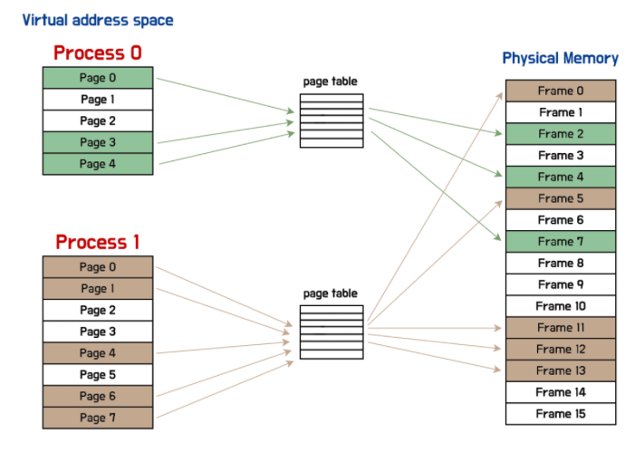
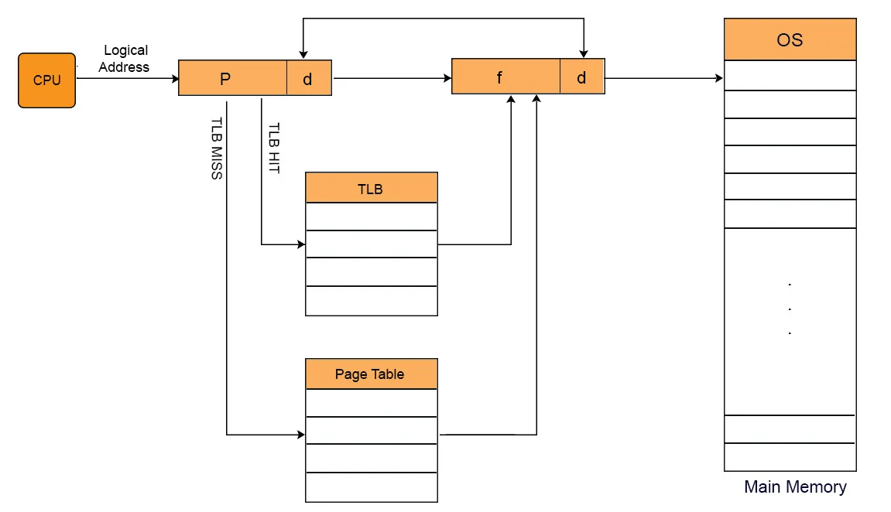
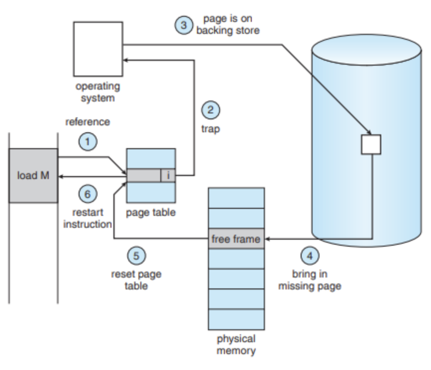
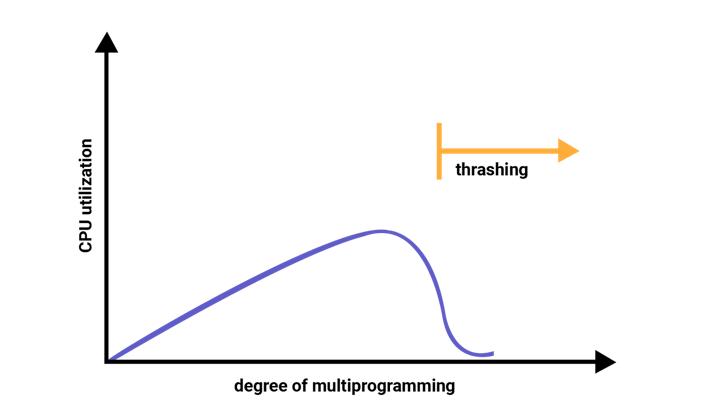

# 가상메모리와 요구 페이징, 페이지 교체

> 메모리? CPU가 직접 접근할 수 있는 기억 장치.
>
> 레지스터 / 캐시 / 주기억장치 / 보조기억장치 

## 가상 메모리(Virtual Memory)

* 가상 메모리는 OS에서 사용되는 메모리 관리 기법의 하나로 컴퓨터가 실제로 이용가능한 메모리 자원(실제 주소, physical address)을 추상화하여 이를 사용하는 사용자들에게 매우 큰 메모리로 보이게 하는 것을 의미한다.

 

> [참고]
> 
> * 가상주소는 MMU와 Page table에 의해 실제 주소로 변환됨
> * Page: 가상 메모리를 사용하는 최소 크기 단위
> * Frame: 실제 디스크나 메모리를 사용하는 최소 크기 단위

### 등장배경

- **실제 메모리보다 큰 공간을 필요로 하는 프로세스를 실행하기 위함**
- 보통 사용하는 RAM의 전체 용량은 8 or 16GB 정도가 보통이다. 그런데 용량이 50GB나 되는 게임들을 어떻게 실행할 수 있을까? -> **가상 메모리**

### 가상 메모리의 핵심 아이디어

- 모든 데이터를 **주 기억장치에 올리지 않고**, **필요한 것들만 올려서** 사용한다.
- 그럼 남은 것들은? **보조 기억장치(HDD, SDD)에 존재**
- **필요할 때 보조 기억장치에서 주 기억장치로 옮겨서 사용한다.**

### 가상 메모리의 장점

- 프로그램이 실제 물리메모리 크기에 제한받지 않는다.
- 여러개의 프로그램을 동시에 실행 할 수 있어 CPU 이용률과 처리율이 증가한다.
- 프로그램 스왑 시에 필요한 입출력이 감소한다.

### TLB

* TLB란 가상 메모리 주소를 물리적 주소로 변환하는 속도를 높이기 위해 사용하는 **캐시**로, 최근에 일어난 **가상 메모리**와 **물리 주소**의 변환 테이블을 저장해 두는 역할을 한다.

* 가상 메모리는 가상주소와 실제주소가 매핑되어있는 페이지 테이블로 관리되며 이 때 속도 향상을 위해 캐싱계층인 `TLB`를 사용한다.
* 가상주소에서 바로 페이지 테이블을 가는게 아니라 TLB에서 있는지를 확인하고 만약 없다면 페이지테이블로 가서 실제주소를 가져온다.

 

## 가상메모리 구현을 위한 핵심 기술

- `요구 페이징 Demand Paging`
- `페이지 교체 Page Replacement`

### 요구 페이징(Demand Paging)

- CPU가 요청할 때, 프로세스의 데이터를 메모리에 올리는 것을 말한다. 
- 즉, 프로세스의 모든 데이터를 메모리에 올리지 않는다. 이로 인해 메모리의 물리적 필요량을 절약할 수 있다.

### 페이지 폴트와 스와핑

* 가상메모리는 작은 메모리를 매우 큰 메모리로 보이게끔 하는 것이기 때문에 참조하려는 메모리 영역이 실제에는 없을 수도 있다. 즉, 가상 메모리에는 존재하지만 실제 메모리인 RAM에는 현재 없는 데이터나 코드에 접근할 경우가 있으며 이 때 페이지 폴트가 발생한다.

* 이 때 메모리의 당장 사용하지 않는 영역을 하드디스크로 옮기고 하드디스크의 일부분을 “마치 메모리처럼” 불러와 쓰는 것을 스와핑이라고 한다.

### 페이지 폴트의 처리 과정

- 유/무효 비트 Valid/Invalid bit
  - valid : 페이지가 메모리에 있는 상태.
  - invalid : 페이지가 스왑공간에 있는 상태.

- invalid 상태 페이지를 참조하는 경우
  - 운영체제는 인터럽트로 페이지 폴트 트랩 page fault trap 을 발생시키고 페이지를 스왑공간에서 가져와 메모리에 올리는 IO발생
  - 해당 프로세스는 IO 작업이 끝날때 까지 대기상태

> ### 페이지 폴트의 처리 과정
>
> 

>     
> 

>
> 1. 어떤 명령어가 유효한 가상주소에 접근했으나 해당 페이지가 만약 없다면 트랩이 발생되어 운영체제에 알리게 됩니다.
> 2. 운영체제는 실제 디스크로부터 사용하지 않은 프레임을 찾습니다.
> 3.  해당 프레임을 실제 메모리에 가져와서 페이지교체알고리즘을 기반으로 특정페이지와 교체합니다. (이 때 스와핑이 일어납니다.)
> 4. 페이지테이블을 갱신시킨 후 해당 명령어를 다시 시작합니다

### 이론적 성능

- 페이지 폴트를 고려한 메모리 접근 시간.
  - 페이지 폴트율에 영향을 받는다.
  - 모든 정보가 메모리에 적재 되어 있을 때 보다 통상적으로 10배 가량 성능 저하 발생
  - 하지만 프로세스의 실행 특성상 메모리를 참조하는데 있어 참조 지역성에 의해 실제로 가상메모리 접근을 통한 성능저하는 드물게 발생한다.

### 성능 고려 사항

- 스왑공간의 효율적인 관리
  - 일반적인 파일 IO 시스템보다 빠른 IO 제공.
    - 한번에 많은 데이터 입출력 단위(block)를 사용.
    - 파일 검색, 간접 할당 기법을 사용하지 않음.
  - 프로세스 실행 시 스왑공간의 사용 방법 선택
    - 프로세스 전체 이미지를 스왑공간에 가져온 뒤 요구 페이징 처리.
  - 프로그램 실행 파일의 스왑공간 저장 여부
    - 프로그램 실행 파일의 경우 read only 형태이기 때문에 스왑 아웃된 경우 스왑공간에 저장하지 않는다.
- 페이지 폴트의 최소화
  - 프로세스의 형태에 매우 의존적이다. 운영체제에서 컨트롤 할 수 없는 부분
  - 페이지 교체의 영향 
    - 페이지 교체의 알고리즘에 의존적
    - 페이지 접근패턴의 분석과 적절한 페이지 교체가 이뤄져야 한다.

### 스레싱(Thrashing)

* 스레싱은 메모리의 페이지 폴트율이 높은 것을 의미한다.
* 스레싱은 메모리에 너무 많은 프로세스가 동시에 올라가게 되면 스와핑이 많이 일어나서 발생함.
* 페이지폴트가 일어나면 CPU 이용률은 낮아진다. CPU 이용률은 낮아지게 되면 운영체제는 CPU의 가용성을 높이기 위해 더 많은 프로세스를 메모리에 올리게 되며, 이러한 악순환이 반복되어 스레싱이 발생한다.

 

### Thrashing 발생 원인

1. 멀티프로그래밍의 정도가 올라가면 하나의 프로세스가 사용할 수 있는 페이지 수가 적어진다.
2. 페이지 수가 적어지면 page fault 발생률이 증가.
3. I/O 계속 발생하고, 이로 인해 CPU 사용량 감소
4. CPU의 사용량이 감소함에 따라 다른 프로세스를 만들어서 메모리를 할당하고 실행한다.
5. page fault
6. I/O 계속 발생하고, 이로 인해 CPU 사용량 감소
7. CPU의 사용량이 감소함에 따라 다른 프로세스를 만들어서 메모리를 할당하고 실행한다.
8. 위 과정이 반복된다.

>  I/O는 "Input/Output"의 약자로, 컴퓨터 시스템에서 데이터를 입력하고 출력하는 과정을 말합니다. 이 용어는 컴퓨터와 외부 환경 또는 사용자 사이에서 데이터를 주고받는 모든 행위를 포괄합니다.

### Thrashing 해결 방법

하드웨어적

* 메모리 용량 증가
* HDD를 사용 중이라면 SSD로 교체

운영체제

* 작업세트
* PFF

#### 작업세트

* 작업세트(working set)는 프로세스의 과거 사용이력을 기반으로 많이 사용하는 페이지집합을 만들어 한꺼번에 미리 메모리에 로드하는 것을 말한다.

#### PFF

* PFF(page fault frequency)는 페이지 폴트 빈도를 조절하는 방법으로 상한선과 하한선을 만들고 상한선에 도달한다면 프레임을 늘리고 하한선에 도달한다면 프레임을 줄이는 방법이다.

### 참고 링크
[[OS/운영체제] 가상 메모리 Virtual Memory)](https://4legs-study.tistory.com/51) 
[가상 메모리의 개념과 요구 페이징](https://www.youtube.com/watch?v=OPS8LSbumPU) 
[가상메모리와 요구 페이징, Valid-Invalid Bit, 페이지 부재 과정](https://code-lab1.tistory.com/59) 
[가상메모리(virtual memory)](https://dding9code.tistory.com/100) 
[OS 가상 메모리와 요구 페이징](https://github.com/devSquad-study/2023-CS-Study/blob/main/OS/os_virtual_memory_and_demand_paging.md)

https://namoo-gamedev.tistory.com/28
